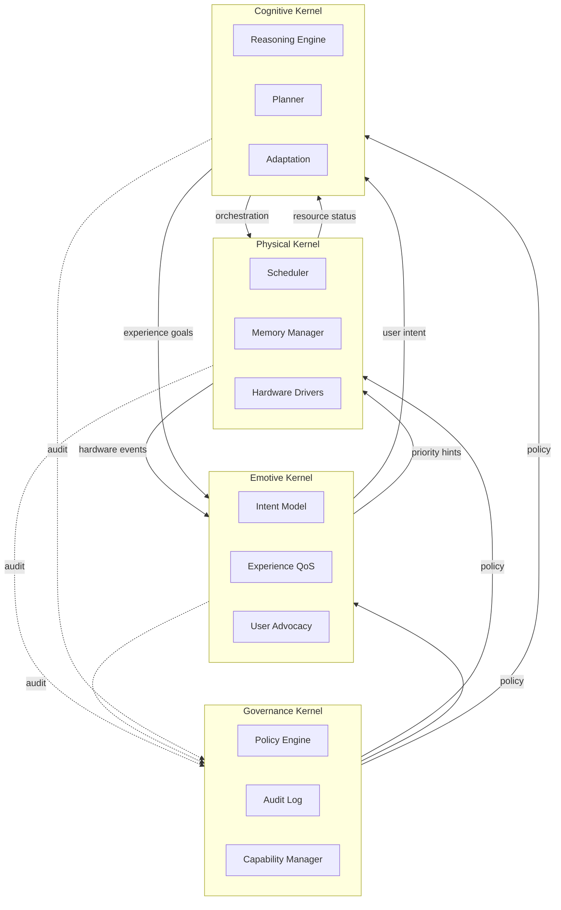
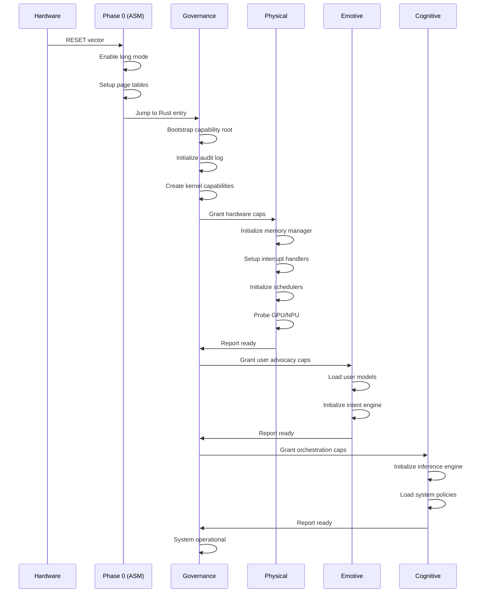
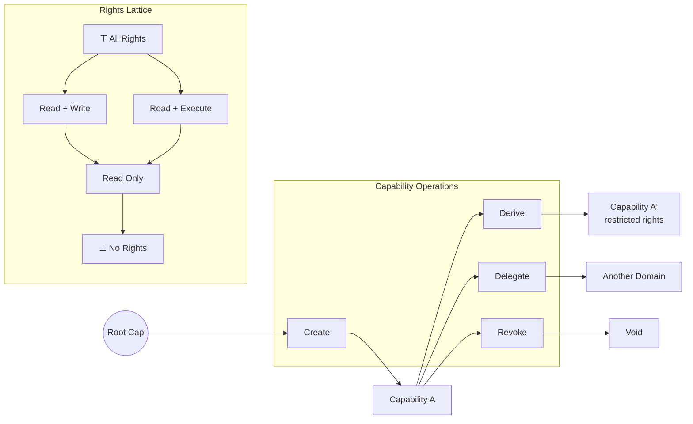

# AETHEROS: Architecture and Design Intent Specification

This document defines the architecture and design intent for AETHEROS, a quadripartite microkernel operating system designed from first principles for modern heterogeneous computing platforms. The system prioritizes user experience, mathematical consistency, and conceptual simplicity while embracing structural complexity. All design decisions are guided by the Japanese aesthetic principle of MA (間)—meaningful negative space—ensuring every abstraction earns its existence.

*Target platform:* AMD Ryzen Threadripper PRO 9000 WX-Series with integrated GPU (RDNA) and NPU (XDNA).

*Execution model:* RAM-resident for maximum performance.

*Primary language:* Rust, with strategic use of C/C++ for AMD ecosystem integration and assembly for hardware primitives.

This specification covers: foundational primitives, capability model, four-kernel architecture (Governance, Physical, Emotive, Cognitive), key innovations (capabilities, dataflow, memory domains, typed channels), inter-kernel communication, RAM-resident execution, formal specification approach, language assessment, heterogeneous compute constraints, GPU/NPU DSL design, AI-assisted development model, critical risks, and bootstrap strategy.


## Philosophical Foundations

### The Problem with Existing Operating Systems

Current operating systems carry accumulated assumptions from decades past:

| Legacy Assumption | Modern Reality |
|---|---|
| CPU is the compute center | CPU is the orchestrator; GPU/NPU perform heavy computation |
| Memory is scarce; disk is storage | Memory is abundant; persistent memory blurs boundaries |
| Processes are isolated kingdoms | Fine-grained sharing with strong isolation required |
| Sequential by default | Parallel by default; sequential is the special case |
| Files are the universal abstraction | Typed, structured data demands richer primitives |
| Security bolted on (DAC/MAC) | Security must be architectural (capabilities) |
| User adapts to system | System serves user |

AETHEROS rejects these assumptions. It is a fresh start.

### Guiding Principles

#### MA (間): Meaningful Negative Space

The system is defined as much by what it _excludes_ as what it includes. Every system call, every abstraction, every capability exists because its absence would create a hole. Nothing ornamental. Nothing vestigial.

> We shape clay into a pot, but it is the emptiness inside that holds whatever we want.
> — *Lao Tzu*


#### Mathematical Consistency

The system is an algebraic object: operations compose, invariants hold, state transitions are total functions. No undefined behavior. No "it depends." The specification _is_ the system; implementation merely instantiates it.

#### Conceptual Simplicity, Structural Complexity

Like a fractal or a fugue: simple generative rules producing rich emergent structure. One model explaining many phenomena. Three primitives. Four kernels. Infinite capability.

#### Full State Awareness

The system always knows what it is. No hidden state. No spooky action at a distance. No "reboot to fix it." State is explicit, observable, and recoverable.

#### User Primacy and the Tripartite Actor Model

The term "user" in AETHEROS encompasses three distinct actor types with hierarchical authority:

| Actor | Description | Authority Source | Primary Objective |
|-------|-------------|------------------|-------------------|
| **Human** | The active human user | Constitutional (innate) | Own goals and intentions |
| **System** | Internal automatic operations | Delegated by Governance | Platform health and maintenance |
| **Synthetic Intelligence (SI)** | AI agents (local or remote) | Delegated by Human or System | Serve delegating principal |

**Authority Hierarchy**: Human > SI (acting for Human) > System > SI (acting for System)

The **Human** is not a "user" in the peripheral sense. The Human is the _purpose_. Every computational act ultimately serves Human intention or is explicitly justified by policy. The system is the Human's advocate.

**Synthetic Intelligence** operates with delegated authority. An SI may act:
- *For the Human* — highest SI authority, nearly equivalent to Human intent
- *For itself* — self-maintenance, learning, capability within granted scope
- *For the System* — lowest SI authority, background optimization tasks

**System** actors perform maintenance functions (garbage collection, defragmentation, health monitoring) that the Human implicitly authorizes by using the platform.


## Architectural Overview

### The Quadripartite Model

AETHEROS employs four specialized kernels, each with distinct ontological status:

```
┌─────────────────────────────────────────────────────────────────────┐
│                                                                     │
│                         GOVERNANCE KERNEL                           │
│                            (Nous/司)                                │
│                                                                     │
│   Policy • Invariants • Arbitration • Oversight                     │
│   "What is permitted? What must always hold?"                       │
│                                                                     │
└─────────────────────────────────────────────────────────────────────┘
         │                    │                    │
         │ policy             │ policy             │ policy
         ▼                    ▼                    ▼
┌─────────────────┐  ┌─────────────────┐  ┌─────────────────┐
│                 │  │                 │  │                 │
│    COGNITIVE    │  │    EMOTIVE      │  │    PHYSICAL     │
│     KERNEL      │  │     KERNEL      │  │     KERNEL      │
│    (Logos/理)   │  │   (Thymos/気)   │  │   (Soma/体)     │
│                 │  │                 │  │                 │
│  Reasoning      │  │  User Advocacy  │  │  Actuation      │
│  Planning       │  │  Prioritization │  │  Sensation      │
│  Inference      │  │  Experience QoS │  │  Memory/IO      │
│  Optimization   │  │  Intent Model   │  │  Timing         │
│                 │  │                 │  │                 │
│  "What should   │  │  "What matters  │  │  "What exists   │
│   we do?"       │  │   to the user?" │  │   and happens?" │
│                 │  │                 │  │                 │
│  DELIBERATIVE   │  │  SUBJECTIVE     │  │  REACTIVE       │
│                 │  │                 │  │                 │
└─────────────────┘  └─────────────────┘  └─────────────────┘
```

#### Kernel Responsibilities

| Kernel | Question Answered | Time Horizon | Nature |
|---|---|---|---|
| *Physical* | What is? What happened? | Immediate | Factual, Reactive |
| *Emotive* | What matters to this user right now? | Near-term | Evaluative, Subjective |
| *Cognitive* | What should we do? | Strategic | Deliberative, Objective |
| *Governance* | What is permitted? What must hold? | Eternal | Normative, Invariant |

#### Why Four Kernels?

This pattern recurs across philosophy and systems theory:

| Tradition | Physical | Emotive | Cognitive | Governance |
|---|---|---|---|---|
| Platonic Soul | Appetite | Spirit (Thymos) | Reason (Logos) | The Good |
| Jungian Functions | Sensation | Feeling | Thinking | Self |
| OODA Loop | Observe | Orient | Decide | Act (oversight) |
| Viable System Model | Operations | Coordination | Control | Policy |

These patterns reflect something true about complex adaptive systems. AETHEROS instantiates this wisdom in silicon.



### Key Innovations

AETHEROS introduces five fundamental innovations that distinguish it from all existing operating systems:

#### 1. Capabilities, Not Permissions

Every resource reference is an unforgeable token encoding _what you can do_. No ambient authority. No access control lists consulted at runtime. This is how seL4 works—and it is the only security model that composes cleanly.

```
Traditional Model:
    Process → "Can I access /dev/gpu0?" → Kernel checks ACL → Yes/No

AETHEROS Model:
    Process holds Capability<GPU, ReadWrite> → Access is the capability
    No runtime check needed; possession IS authorization
```

#### 2. Compute as Dataflow, Not Threads

Instead of "spawn thread, manage synchronization," computation is expressed as graphs:

```
[Sensor Input] → [Preprocess:NPU] → [Inference:GPU] → [Decision:CPU] → [Output]
```

The Cognitive kernel schedules across heterogeneous compute units. This is what AMD attempts with ROCm—but at the wrong abstraction layer. AETHEROS makes it foundational.

#### 3. Memory Domains with Explicit Coherence

Modern heterogeneous systems have _multiple_ memory spaces with different coherence guarantees. AETHEROS exposes this cleanly rather than hiding it:

| Coherence | Semantics |
|---|---|
| *coherent* | Hardware-maintained (CPU RAM, CXL Type 3) |
| *explicit* | Requires sync primitives (GPU VRAM, shared buffers) |

Persistence is orthogonal—any domain can have `persistent: true` for power-loss survival (Optane, CXL-PM, battery-backed).

#### 4. Everything is a Typed Channel

Not "everything is a file" (too unstructured) or "everything is an object" (too heavyweight). AETHEROS uses typed, capability-protected channels with schema evolution:

```lean
-- Channels are typed; protocol violations are compile errors
def sensorChannel : Channel SensorReading := ...

-- Session types ensure correct sequencing
session GPUJob where
  client sends   : ComputeGraph
  server sends   : Placement
  client sends   : Confirm
  server sends   : JobHandle
  -- ...
```

#### 5. Tripartite Network Channels

All network communication is classified into three isolated channel classes with strict security boundaries:

| Channel | Purpose | Security |
|---------|---------|----------|
| **Internal Local** | System telemetry, health monitoring | Highest priority, physically isolated partition |
| **Private** | User-initiated trusted communications | Encrypted, user-approved endpoints |
| **Inbound Public** | External internet traffic | NEVER routes to System actor |

```
Priority: Internal (1) > Private (2) > Public (3)

Critical invariant: System actor NEVER receives from public channels
                    Internal partition NEVER shares resources with public
```

This eliminates entire classes of attacks where external traffic could influence system behavior.

### System Layers

The complete AETHEROS architecture forms four distinct layers:

```
┌────────────────────────────────────────────────────────────────┐
│                      User Space                                │
│    Applications, Services, Shells                              │
│    (Language-agnostic, capability-constrained)                 │
├────────────────────────────────────────────────────────────────┤
│                   Compute Fabric Runtime                       │
│    Unified scheduling across CPU/GPU/NPU                       │
│    Dataflow graphs, not threads                                │
│    Memory: explicit coherence domains, zero-copy channels      │
├────────────────────────────────────────────────────────────────┤
│                    Microkernel Core                            │
│    Four kernels: Governance, Emotive, Cognitive, Physical      │
│    Capabilities, IPC, resource accounting                      │
│    Minimal TCB (~15-20K lines target)                          │
│    Formally verifiable where possible                          │
├────────────────────────────────────────────────────────────────┤
│                   Hardware Abstraction                         │
│    CPU (Zen 5), GPU (RDNA), NPU (XDNA)                         │
│    Unified address space with explicit domains                 │
└────────────────────────────────────────────────────────────────┘
```


## Foundational Primitives

### The Three Primitives

> **MA Principle: Every primitive must earn its existence. Nothing ornamental, nothing vestigial.**

Every concept in AETHEROS derives from exactly three primitives:

| Primitive | Meaning | Mathematical Structure |
|---|---|---|
| *Capability* | Authority to act (encapsulates resource + rights + provenance) | Morphism in a category |
| *State* | System configuration (partitioned by isolation domains) | Product of domain states |
| *Transition* | State change rule (event-driven, capability-mediated) | Total function on states |

**Derived concepts** (not primitives):
- *Resource* — Implicit in Capability; no resource exists without authority over it
- *Domain* — Partition of State; an organizational concept, not a primitive
- *Channel* — Derivable from Capability (send rights) + Transition (message transfer)

Everything else—processes, threads, files, memory, devices—is _derivable_ from these three.

### Core Equations

[stem]
\text{System} := (\text{Capabilities}, \text{State}, \text{Transitions})

[stem]
\text{State} := \prod_{d : \text{Domain}} \text{DomainState}(d)

[stem]
\text{Transition} : \text{State} \times \text{Event} \to \text{State}

[stem]
\text{Capability} := (\text{Target}, \text{Rights}, \text{Provenance})

The invariant preservation property:

[stem]
\forall\, t : \text{Transition},\, \forall\, \text{inv} : \text{Invariant} \implies \text{inv}(\text{state}) \Rightarrow \text{inv}(t(\text{state}, \text{event}))

### Unified Priority Model

> **MA Principle: Single priority representation with context-specific projections.**

AETHEROS uses one canonical priority structure, avoiding independent priority systems that could conflict:

```lean
-- Canonical urgency levels (used across all kernels)
inductive Urgency where
  | critical    -- Life-safety, data loss imminent
  | high        -- User-perceivable latency impact
  | normal      -- Standard interactive work
  | low         -- Background, can tolerate delay
  | background  -- Opportunistic, lowest priority
  deriving Ord, DecidableEq, Repr

-- The single canonical priority structure
structure CanonicalPriority where
  urgency    : Urgency           -- Time criticality
  deadline   : Option Timestamp  -- Absolute deadline (if any)
  class      : PriorityClass     -- Categorization for scheduling policy

inductive PriorityClass where
  | realtime    -- Hard deadline, preempts everything
  | interactive -- User-facing, low latency
  | batch       -- Throughput-oriented
  | idle        -- Only when system idle
  deriving DecidableEq, Repr

-- Interrupt priority levels (canonical definition)
-- Physical kernel uses these for interrupt handling decisions
inductive InterruptLevel where
  | critical   -- Cannot be masked, immediate dispatch (NMI, exceptions)
  | realtime   -- Maskable but time-sensitive (timer, IPI)
  | deferred   -- Can be coalesced, batched (device, MSI)
  deriving Ord, DecidableEq, Repr

-- Projection to interrupt handling (Physical kernel)
def CanonicalPriority.toInterruptLevel (p : CanonicalPriority) : InterruptLevel :=
  match p.urgency, p.class with
  | .critical, _         => .critical
  | _, .realtime         => .realtime
  | .high, .interactive  => .realtime
  | _, _                 => .deferred

-- Projection to placement weights (Cognitive kernel)
def CanonicalPriority.toPlacementWeights (p : CanonicalPriority) : PlacementWeights :=
  p.urgency.toWeights  -- Uses existing Urgency.toWeights

-- Emotive kernel's Priority is a rich wrapper around CanonicalPriority
-- (See Emotive Kernel Specification for full structure)
```

**Key invariant**: Any priority value anywhere in the system can be derived from a `CanonicalPriority`. No kernel invents its own priority semantics.


## Boot Sequence Specification

AETHEROS employs a phased boot sequence that progressively initializes each kernel in dependency order, ensuring capability sovereignty from the first instruction.



### Phase 0: Hardware Initialization (Assembly)

The boot sequence begins in x86-64 real mode with minimal assembly code (~500 lines):

```asm
; AETHEROS Boot Phase 0 - Hardware Initialization
; Target: AMD Zen 5 (Threadripper PRO 9995WX)

section .boot
    ; 1. CPU in real mode after RESET (BIOS/UEFI hands control)
    ; 2. Verify UEFI boot services available
    ; 3. Query memory map via UEFI GetMemoryMap()
    ; 4. Initialize memory controller configuration
    ; 5. Enable long mode (64-bit)
    ;    - Set CR0.PE (protected mode)
    ;    - Set CR4.PAE (physical address extension)
    ;    - Load CR3 with initial page table
    ;    - Set EFER.LME (long mode enable)
    ;    - Set CR0.PG (paging enable)
    ; 6. Establish initial page tables (identity mapping for first 4GB)
    ; 7. Initialize GDT/IDT with minimal descriptors
    ; 8. Load Governance kernel from NVMe to predetermined RAM address
    ; 9. Jump to Governance kernel entry point (Rust)
```

**Timing Bound:** Phase 0 completes in < 100ms on target hardware.

**Invariant:** No Rust code executes until long mode is established and page tables are valid.

### Phase 1: Governance Kernel Bootstrap (Rust)

The Governance kernel is the first Rust code to execute:

```rust
/// Governance Kernel Bootstrap Entry Point
#[no_mangle]
pub extern "C" fn governance_init(boot_info: &BootInfo) -> ! {
    // 1. Initialize capability root (self-referential bootstrap)
    let root_cap = CapabilityRoot::bootstrap();

    // 2. Initialize memory allocator with boot-provided memory map
    unsafe { ALLOCATOR.init(boot_info.memory_map) };

    // 3. Create initial capability table
    let cap_table = CapabilityTable::new(root_cap);

    // 4. Initialize audit log in persistent memory region
    let audit = AuditLog::init(boot_info.persistent_region);

    // 5. Load Physical kernel image from predetermined location
    let physical_image = load_kernel_image(PHYSICAL_KERNEL_ADDR);

    // 6. Create Physical kernel capabilities
    let physical_caps = create_physical_capabilities(&cap_table, boot_info);

    // 7. Transfer control to Physical kernel init
    physical_image.start(physical_caps)
}
```

**Invariants:**
- `cap_table.root() == root_cap` — Capability table traces to root
- `∀ cap ∈ cap_table: provenance(cap) ⊆ root_cap` — No orphan capabilities

**Timing Bound:** Phase 1 completes in < 50ms.

### Phase 2: Physical Kernel Initialization

The Physical kernel takes ownership of hardware resources:

```rust
/// Physical Kernel Initialization
pub fn physical_init(caps: PhysicalCapabilities) -> PhysicalState {
    // 1. Enumerate hardware via ACPI tables
    let acpi = ACPI::parse(caps.acpi_tables);
    let topology = acpi.numa_topology();

    // 2. Initialize Advanced Programmable Interrupt Controller (APIC)
    let apic = APIC::init(caps.interrupt_cap);
    apic.set_timer(SCHEDULER_QUANTUM);

    // 3. Initialize memory domains based on NUMA topology
    let domains = MemoryDomains::init(&topology, caps.memory_caps);

    // 4. Initialize minimal device driver set
    //    - NVMe (for checkpoint persistence)
    //    - Serial (for debug output)
    //    - Timer (for scheduling)
    let drivers = MinimalDriverSet::init(&acpi, &caps);

    // 5. Initialize GPU/NPU in low-power standby
    let gpu = GPU::init_standby(caps.gpu_cap);
    let npu = NPU::init_standby(caps.npu_cap);

    // 6. Signal readiness to Governance via IPC
    governance_channel.send(PhysicalReady {
        hardware_inventory: acpi.inventory(),
        memory_available: domains.total_available(),
    });

    PhysicalState::new(domains, apic, drivers, gpu, npu)
}
```

**Hardware Enumeration Details:**

| Component | Discovery Method | Initialization |
|``````---|````````````--|````````````|
| CPU Cores | ACPI MADT | Per-core APIC setup |
| NUMA Nodes | ACPI SRAT | Memory domain creation |
| PCIe Devices | ECAM enumeration | Capability assignment |
| GPU | PCIe BAR + AMD detection | MMIO mapping |
| NPU | PCIe BAR + XDNA detection | DMA buffer allocation |
| NVMe | PCIe + NVMe namespace | Block device init |

**Timing Bound:** Phase 2 completes in < 500ms (dominated by device enumeration).

### Phase 3: Emotive Kernel Initialization

The Emotive kernel initializes user experience infrastructure:

```rust
/// Emotive Kernel Initialization
pub fn emotive_init(caps: EmotiveCapabilities) -> EmotiveState {
    // 1. Load default user preference profile (or create if first boot)
    let profile = UserProfile::load_or_default(caps.storage_cap);

    // 2. Initialize intent model with uniform priors
    let intent = IntentModel::new_uniform(profile.known_goals());

    // 3. Initialize experience quality baseline
    let experience = ExperienceQuality::baseline();

    // 4. Initialize presence detector (initially assumes user present)
    let presence = PresenceState::ActiveFocus {
        since: Moment::now(),
        intensity: Intensity::Normal,
    };

    // 5. Begin receiving sensor events from Physical kernel
    physical_channel.subscribe(SensorEventFilter::UserRelevant);

    // 6. Signal readiness
    governance_channel.send(EmotiveReady);

    EmotiveState::new(intent, experience, presence, profile)
}
```

**Timing Bound:** Phase 3 completes in < 100ms.

### Phase 4: Cognitive Kernel Initialization

The Cognitive kernel initializes computation infrastructure:

```rust
/// Cognitive Kernel Initialization
pub fn cognitive_init(caps: CognitiveCapabilities) -> CognitiveState {
    // 1. Initialize scheduler with empty compute graph
    let scheduler = Scheduler::new();

    // 2. Initialize placement engine
    let placement = PlacementEngine::new(caps.compute_caps);

    // 3. Connect to Physical kernel for resource status
    physical_channel.subscribe(ResourceStatusFilter::All);

    // 4. Connect to Emotive kernel for priority directives
    emotive_channel.subscribe(PriorityFilter::All);

    // 5. Query Physical for available compute units
    let units = physical_channel.query(ComputeUnitInventory);
    placement.register_units(units);

    // 6. System ready for user workloads
    governance_channel.send(CognitiveReady);
    broadcast(SystemReady);

    CognitiveState::new(scheduler, placement)
}
```

**Timing Bound:** Phase 4 completes in < 50ms.

### Boot Sequence Invariants

The following invariants hold throughout the boot process:

```lean
-- Boot sequence correctness theorem
theorem boot_completes (hw : HardwareState) (images : KernelImages) :
    hw.healthy ∧ images.valid ∧ images.signed →
      ◇ SystemState.ready := by
  intro ⟨hwOk, imgOk, sigOk⟩
  -- Phase 0 completes given healthy hardware
  have p0 : Phase0Complete := phase0_terminates hw hwOk
  -- Phase 1 completes given valid Governance image
  have p1 : Phase1Complete := phase1_terminates p0 images.governance imgOk.1
  -- Phase 2 completes given Physical capabilities
  have p2 : Phase2Complete := phase2_terminates p1 p1.physical_caps
  -- Phase 3 and 4 complete in parallel
  have p3 : Phase3Complete := phase3_terminates p1.emotive_caps
  have p4 : Phase4Complete := phase4_terminates p1.cognitive_caps p2
  -- System ready when all phases complete
  exact system_ready_from_phases p1 p2 p3 p4

-- Capability sovereignty: all capabilities trace to Governance
theorem capability_sovereignty_at_boot :
    ∀ k : Kernel, k ≠ .governance →
      ∀ cap ∈ k.capabilities →
        DerivedFrom cap governanceState.capabilityRoot := by
  intro k hneq cap hmem
  cases k with
  | physical => exact phase1_grants_physical cap hmem
  | emotive => exact phase1_grants_emotive cap hmem
  | cognitive => exact phase1_grants_cognitive cap hmem
  | governance => contradiction

-- No capability exists before Governance creates it
theorem no_premature_capabilities :
    ∀ t : Timestamp, t < phase1_start →
      capabilities = ∅ := by
  intro t ht
  exact no_rust_before_phase1 ht
```

### Boot Timing Summary

| Phase | Duration | Cumulative | Kernel Initialized |
|```---|``````--|`````````|````````````---|
| 0 | < 100ms | 100ms | (Hardware) |
| 1 | < 50ms | 150ms | Governance |
| 2 | < 500ms | 650ms | Physical |
| 3 | < 100ms | 750ms | Emotive |
| 4 | < 50ms | 800ms | Cognitive |

**Total Boot Time:** < 800ms from power-on to SystemReady.

### Recovery Boot

If a valid checkpoint exists, AETHEROS can perform recovery boot:

```rust
/// Recovery boot from checkpoint
pub fn recovery_boot(checkpoint: Checkpoint) -> SystemState {
    // 1. Verify checkpoint integrity
    assert!(checkpoint.verify_hash());
    assert!(checkpoint.epoch > 0);

    // 2. Restore kernel states
    let governance = checkpoint.governance.restore();
    let physical = checkpoint.physical.restore();
    let emotive = checkpoint.emotive.restore();
    let cognitive = checkpoint.cognitive.restore();

    // 3. Replay journal entries since checkpoint
    let journal = load_journal_since(checkpoint.epoch);
    for entry in journal {
        apply_journal_entry(&mut state, entry);
    }

    // 4. Resume normal operation
    SystemState::restored(governance, physical, emotive, cognitive)
}
```

**Recovery Time:** < 2 seconds from valid checkpoint.


## Capability Model



### Rights Lattice

Capabilities carry rights. Rights form a bounded lattice:

```lean
-- The rights a capability can carry
inductive Right where
  | read      -- observe resource state
  | write     -- modify resource state
  | execute   -- invoke resource behavior
  | grant     -- delegate capability to another domain
  | revoke    -- withdraw delegated capabilities
  deriving DecidableEq, Repr

-- Rights form a bounded lattice under set operations
-- ⊤ = all rights, ⊥ = no rights
-- meet = intersection, join = union
```

### Actor Model (Tripartite Principals)

The system recognizes three types of actors—principals that may hold capabilities and initiate actions:

```lean
-- The three actor types in AETHEROS
inductive ActorType where
  | human      -- The active human user (constitutional authority)
  | system     -- Internal automatic operations (delegated by governance)
  | synthetic  -- AI/SI agents (delegated by human or system)
  deriving DecidableEq, Repr

-- For SI actors, track the delegating principal
inductive SIDelegation where
  | forHuman   -- Acting on human's behalf (highest SI authority)
  | forSelf    -- Self-maintenance, learning (medium authority)
  | forSystem  -- System optimization tasks (lowest SI authority)
  deriving DecidableEq, Ord, Repr

-- An actor identity with full provenance
structure Actor where
  id          : ActorId           -- Unique identifier
  actorType   : ActorType         -- Human, System, or Synthetic
  delegation  : Option SIDelegation  -- Only for synthetic actors
  credentials : Credentials       -- Authentication proof
  epoch       : Epoch             -- Session validity

-- Authority ordering: Human > SI(forHuman) > System > SI(forSystem) > SI(forSelf)
def Actor.authorityLevel (a : Actor) : Nat :=
  match a.actorType, a.delegation with
  | .human, _                   => 100  -- Highest authority
  | .synthetic, some .forHuman  => 90   -- Near-human authority
  | .system, _                  => 50   -- Platform maintenance
  | .synthetic, some .forSystem => 30   -- System helper
  | .synthetic, some .forSelf   => 20   -- Self-maintenance only
  | .synthetic, none            => 10   -- Undelegated SI (minimal)

-- SI acting for Human can nearly match Human authority
-- but cannot exceed the delegating Human's own capabilities
theorem si_authority_bounded (si : Actor) (human : Actor) :
    si.actorType = .synthetic →
    si.delegation = some .forHuman →
    si.authorityLevel < human.authorityLevel
```

### Capability Structure

```lean
-- A capability is authority over a resource with specific rights
structure Capability (Resource : Type) where
  resource   : Resource
  rights     : Rights
  provenance : Provenance  -- for revocation tracking
  epoch      : Epoch       -- for temporal validity

-- Capabilities are unforgeable by construction
-- Only Governance kernel can create root capabilities
-- All others derive via delegation
```

### Fundamental Security Properties

#### No Forgery

```lean
theorem no_forgery (s s' : SystemState) (k : Kernel) (c : Capability) :
    c ∈ capabilities k s' →
      c ∈ capabilities k s ∨                    -- already possessed
      (∃ k', Delegated k' k c s s') ∨           -- received via delegation
      (k = .governance ∧ Created c s s')        -- governance created it
```

#### No Amplification

```lean
-- Restriction can only reduce rights, never amplify
def restrict (c : Capability R) (mask : Rights) : Capability R :=
  { c with rights := c.rights ∩ mask }

theorem restrict_monotonic (c : Capability R) (m1 m2 : Rights) :
    m1 ⊆ m2 → (restrict c m1).rights ⊆ (restrict c m2).rights
```

#### Revocation Propagation

```lean
-- When a capability is revoked, all derivatives are also revoked
theorem revocation_propagation (c : Capability) (s s' : SystemState) :
    Revoked c s s' →
      ∀ c' : Capability, DerivedFrom c' c →
        ¬ Valid c' s'
```


## Governance Kernel Specification

### Purpose

The Governance kernel is the _constitutional authority_ of the system. It:

- Holds the root capability from which all others derive
- Defines and enforces system-wide invariants
- Arbitrates conflicts between kernels
- Manages resource budgets across the system
- Maintains audit logs for accountability

#### Telemetry Aggregation: All Kernels

The Governance kernel receives and aggregates health telemetry from **all other kernels**:

| Source Kernel | Telemetry Received | Governance Action |
|---------------|-------------------|-------------------|
| **Physical** | System actor health (hardware, resources) | Resource budget enforcement |
| **Emotive** | Human health, usefulness, performance | User primacy verification |
| **Cognitive** | SI health, accuracy, truthfulness | Capability scope enforcement |

```lean
-- Aggregate health from all kernels
structure AggregateHealth where
  physical  : SystemActorHealth    -- From Physical kernel
  emotive   : HumanActorHealth     -- From Emotive kernel
  cognitive : SIActorHealth        -- From Cognitive kernel

  -- Computed aggregates
  overallHealth   : Score          -- Weighted combination
  healthyKernels  : Count          -- Kernels meeting thresholds
  criticalAlerts  : List Alert     -- Cross-kernel issues

-- Is the overall system healthy?
def Governance.isSystemHealthy (s : GovernanceState) : Bool :=
  s.aggregateHealth.healthyKernels = 3 ∧  -- All kernels healthy
  s.aggregateHealth.criticalAlerts.isEmpty
```

#### System-Wide Responsibility: Security and Policy

The Governance kernel owns all **security and policy telemetry**:

| Telemetry Domain | Metrics | Health Indicators |
|------------------|---------|-------------------|
| **Capabilities** | Grants, revocations, derivations | Escalation attempts, orphaned caps |
| **Policy** | Rule evaluations, violations, overrides | Policy drift, conflict rate |
| **Audit** | Log entries, queries, integrity checks | Log tampering, gaps |
| **Cross-Kernel** | IPC messages, arbitrations, budgets | Deadlock detection, resource exhaustion |

```lean
-- Security health: is the system maintaining its security invariants?
structure SecurityHealth where
  -- Capability integrity
  capabilityChainValid   : Bool      -- All caps trace to root
  escalationAttempts     : Count     -- Unauthorized privilege requests
  revocationLatency      : Duration  -- Time to propagate revocations

  -- Policy compliance
  policyViolations       : Count     -- Rules broken (should be 0)
  invariantsSatisfied    : Ratio     -- Active invariants holding
  auditIntegrity         : Bool      -- Log hash chain valid

  -- Cross-kernel security
  ipcAnomalies           : Count     -- Unexpected message patterns
  budgetOverruns         : Count     -- Kernels exceeding quotas

-- Is the security posture acceptable?
def Governance.isSecurityHealthy (s : GovernanceState) : Bool :=
  s.securityHealth.capabilityChainValid ∧
  s.securityHealth.policyViolations = 0 ∧
  s.securityHealth.invariantsSatisfied = 1.0 ∧
  s.securityHealth.auditIntegrity

-- Critical: User Primacy Invariant check
def Governance.isUserPrimacyMaintained (s : GovernanceState) : Bool :=
  s.aggregateHealth.emotive.valueRealization.goalCompletionRate > 0.7 ∧
  s.securityHealth.policyViolations = 0 ∧
  s.aggregateHealth.emotive.performanceHealth.perceivedLag < 0.5
```

Governance is the only kernel that sees the full system picture—it's the constitutional watchdog ensuring all kernels serve the Human.

### State Structure

```lean
structure GovernanceState where
  capabilityRoot      : Capability Root
  grantedCapabilities : Kernel → List Capability
  activeInvariants    : List Invariant
  resourceBudgets     : Kernel → ResourceBudget
  auditLog            : List AuditEntry
  policyRules         : List PolicyRule
  systemEpoch         : Epoch
```

### Invariants

```tla
\* Governance sovereignty: all capabilities trace to governance
GovernanceSovereignty ==
    ∀ k ∈ Kernels \ {governance} :
        ∀ c ∈ capabilities[k] :
            DerivedFrom(c, governanceState.capabilityRoot)

\* Budget conservation: total grants ≤ total resources
BudgetConservation ==
    ∀ r ∈ Resources :
        Sum(k ∈ Kernels : resourceBudgets[k][r]) ≤ TotalAvailable(r)

\* Audit completeness: all capability changes logged
AuditCompleteness ==
    ∀ c ∈ Capability, k ∈ Kernel :
        (c ∈ capabilities'[k] ∧ c ∉ capabilities[k]) ⇒
            ∃ entry ∈ auditLog' : entry.capability = c ∧ entry.target = k
```

### Operations

| Operation | Description | Authority |
|---|---|---|
| `grantCapability` | Delegate capability to a kernel | Governance only |
| `revokeCapability` | Withdraw capability from a kernel | Governance only |
| `setResourceBudget` | Allocate resource quota to kernel | Governance only |
| `enforceInvariant` | Activate a system invariant | Governance only |
| `arbitrate` | Resolve inter-kernel conflict | Governance only |
| `queryAudit` | Read audit log entries | Any kernel (filtered by capability) |


## Physical Kernel Specification

### Purpose

The Physical kernel is the _embodiment_ of the system. It:

- Manages all hardware resources directly
- Handles interrupts and exceptions
- Controls memory domains and DMA
- Manages device state
- Provides timing services
- Interfaces with GPU and NPU hardware

#### Telemetry Ownership: System Actor

The Physical kernel owns all **System actor** telemetry and health:

| Telemetry Domain | Metrics | Health Indicators |
|------------------|---------|-------------------|
| **Hardware** | CPU utilization, temperature, power | Thermal limits, power budget |
| **Memory** | Usage, fragmentation, DMA activity | Pressure thresholds, leak detection |
| **Storage** | I/O throughput, latency, queue depth | Disk health, SMART status |
| **Network** | Bandwidth, packet rates, errors | Link status, congestion |
| **Compute Units** | GPU/NPU utilization, memory | Driver health, thermal throttling |

The Physical kernel reports aggregated System health to Governance via the Internal Local channel.

### State Structure

```lean
structure PhysicalState where
  -- Memory management
  memoryDomains     : List MemoryDomain
  pageTableRoots    : Domain → PageTableRoot
  dmaBuffers        : List DMABuffer

  -- Device management
  deviceStates      : DeviceId → DeviceState
  interruptState    : InterruptController
  pendingInterrupts : Queue Interrupt

  -- Timing
  systemTime        : Timestamp
  timerQueues       : List TimerEntry

  -- CPU core dispatch (execution state, NOT scheduling decisions)
  -- Physical enforces; Cognitive decides (see Scheduler Ownership Model)
  cpuDispatchState  : CPUDispatchState

  -- Heterogeneous compute (hardware state only)
  gpuState          : GPUState
  npuState          : NPUState

  -- Health metrics (reported to Emotive)
  resourceMetrics   : ResourceId → Metrics
```

### Memory Domain Model

AETHEROS exposes memory heterogeneity explicitly:

```lean
-- MA: Two coherence modes capture the fundamental hardware distinction
-- Persistence is orthogonal (attribute, not type)
inductive MemoryCoherence where
  | coherent    -- Hardware-maintained (CPU-coherent RAM, CXL Type 3)
  | explicit    -- Requires explicit sync (GPU VRAM, shared buffers)
  deriving DecidableEq, Repr

-- Persistence is an attribute, not a domain type
-- Applies to any coherence mode (Optane, CXL-PM, battery-backed)
structure MemoryDomain where
  coherence    : MemoryCoherence
  persistent   : Bool              -- Survives power loss
  baseAddress  : PhysicalAddress
  size         : Size
  owner        : Domain
  numaNode     : NUMANode

-- Convenience predicates for common patterns
def MemoryDomain.isGPULocal (d : MemoryDomain) : Bool :=
  d.coherence = .explicit ∧ d.numaNode.isGPU

def MemoryDomain.isCPUAccessible (d : MemoryDomain) : Bool :=
  d.coherence = .coherent ∨ d.numaNode.hasMMIO
```

### Hardware Mapping

```
Threadripper PRO 9995WX Physical Layout:

┌────────────────────────────────────────────────────────────────────────┐
│                         3TB RAM Address Space                          │
├────────────────────────────────────────────────────────────────────────┤
│                                                                        │
│  ┌──────────────┐ ┌──────────────┐ ┌──────────────┐ ┌──────────────┐  │
│  │  Governance  │ │  Cognitive   │ │   Emotive    │ │   Physical   │  │
│  │    Region    │ │    Region    │ │    Region    │ │    Region    │  │
│  │   (NUMA 0)   │ │  (NUMA 1-2)  │ │   (NUMA 3)   │ │   (NUMA 4)   │  │
│  │    ~64MB     │ │   ~512MB     │ │   ~128MB     │ │   ~256MB     │  │
│  └──────────────┘ └──────────────┘ └──────────────┘ └──────────────┘  │
│                                                                        │
│  ┌─────────────────────────────────────────────────────────────────┐  │
│  │                    Shared Channel Region                         │  │
│  │            (explicitly coherent, message buffers)                │  │
│  │                         ~256MB                                   │  │
│  └─────────────────────────────────────────────────────────────────┘  │
│                                                                        │
│  ┌─────────────────────────────────────────────────────────────────┐  │
│  │                    Application Space                             │  │
│  │              (capability-partitioned domains)                    │  │
│  │                    ~2.99TB remaining                             │  │
│  └─────────────────────────────────────────────────────────────────┘  │
│                                                                        │
└────────────────────────────────────────────────────────────────────────┘

CPU Core Assignment (96 cores):
├── Governance:   4 cores (dedicated, highest priority)
├── Cognitive:   24 cores (deliberative computation, GPU/NPU control)
├── Emotive:      8 cores (monitoring, intent inference)
├── Physical:    16 cores (I/O, interrupts, device management)
└── Application: 44 cores (user workloads, dynamically scheduled)
```

### Operations

| Operation | Description | Authority |
|---|---|---|
| `allocateMemory` | Create memory region in specified domain type | Physical (authorized by Governance) |
| `mapMemory` | Establish virtual→physical mapping | Physical |
| `initiateTransfer` | Begin DMA or device I/O | Physical |
| `registerInterrupt` | Establish interrupt handler | Physical |
| `queryTime` | Read system timestamp | Any kernel |
| `setTimer` | Schedule timer callback | Any kernel |
| `submitGPU` | Enqueue GPU work | Physical (on behalf of Cognitive) |
| `submitNPU` | Enqueue NPU inference | Physical (on behalf of Cognitive) |

### Interrupt Handling Specification

The Physical kernel owns all hardware interrupts and is responsible for timely, predictable interrupt handling. This section specifies the interrupt architecture with concrete latency Service Level Objectives (SLOs).

#### Interrupt Classification

```lean
-- Interrupt class enumeration (source classification)
-- MA principle: 5 classes reduced to 3 - each class has distinct handling semantics
inductive InterruptClass where
  | critical      -- NMI, machine check, exceptions - non-maskable, immediate
  | realtime      -- Timer, IPI - scheduling-critical, low-latency
  | deferred      -- Device completion, polling - can be batched/coalesced
  deriving DecidableEq, Repr

-- Mapping from hardware sources to interrupt classes
def classifyInterruptSource : HardwareSource → InterruptClass
  | .nmi             => .critical
  | .machineCheck    => .critical
  | .exception _     => .critical
  | .timer           => .realtime
  | .ipi             => .realtime
  | .device _        => .deferred
  | .msi _           => .deferred

-- Interrupt priority levels: uses canonical InterruptLevel
-- (Defined in Unified Priority Model section)
-- Each level has clear semantics and preemption rules

-- Priority directly maps from class (no arbitrary assignment)
def classToPriority : InterruptClass → InterruptLevel
  | .critical => .critical
  | .realtime => .realtime
  | .deferred => .deferred

-- Preemption matrix (3x3 = 9 cells, not 25)
-- Entry (a, b) = true iff priority a can preempt priority b
def InterruptLevel.canPreempt : InterruptLevel → InterruptLevel → Bool
  | .critical, _         => true   -- Critical preempts all
  | .realtime, .deferred => true   -- Realtime preempts deferred
  | .realtime, .realtime => false  -- Same level: no preemption
  | .deferred, _         => false  -- Deferred never preempts

-- Interrupt descriptor with handler metadata
structure InterruptDescriptor where
  class       : InterruptClass
  vector      : Fin 256               -- x86-64 interrupt vector
  handler     : Kernel                -- Which kernel handles this
  priority    : InterruptLevel        -- Uses canonical InterruptLevel
  affinity    : Option CoreId         -- Core affinity (None = any)

-- Derived: preemption is determined by priority, not per-descriptor list
def preemptsKernel (id : InterruptDescriptor) (k : Kernel) : Bool :=
  id.priority.canPreempt (kernelCurrentPriority k)
```

#### Latency Service Level Objectives

AETHEROS provides soft real-time guarantees on interrupt response latency:

```lean
-- Interrupt latency SLO: time from hardware signal to handler entry
-- (MA: 3 classes, each with single latency target)
def interruptLatencySLO : InterruptClass → Duration
  | .critical  => 1.μs       -- NMI, exceptions: immediate response required
  | .realtime  => 10.μs      -- Timer, IPI: scheduling-critical
  | .deferred  => 100.μs     -- Devices: can tolerate coalescing

-- Handler completion time budget (worst-case)
def handlerBudget : InterruptClass → Duration
  | .critical  => 20.μs      -- Log, potentially panic, minimal work
  | .realtime  => 50.μs      -- Update scheduler state, signal waiters
  | .deferred  => 500.μs     -- Copy completion status, batch processing
```

#### Interrupt Vector Assignment

```
x86-64 Interrupt Vector Layout:

Vector Range    | Class           | Assignment
````````````|````````````-|````````````````````````--
0x00 - 0x1F     | exception       | CPU exceptions (fixed by hardware)
0x20 - 0x2F     | reserved        | Legacy PIC (unused, masked)
0x30            | timer           | Local APIC timer
0x31 - 0x3F     | ipi             | Inter-processor interrupts
0x40 - 0xEF     | device          | MSI/MSI-X device interrupts
0xF0 - 0xFD     | reserved        | Future expansion
0xFE            | nmi             | Non-maskable interrupt (remapped)
0xFF            | critical        | Spurious interrupt vector
```

#### Ownership Theorem

```lean
-- Physical kernel owns all hardware interrupts
theorem physical_owns_interrupts :
    ∀ id : InterruptDescriptor,
      id.class ∈ [.timer, .device, .nmi] →
        id.handler = .physical := by
  intro id h
  cases h with
  | inl h_timer => exact interrupt_table_timer_physical
  | inr h_rest => cases h_rest with
    | inl h_device => exact interrupt_table_device_physical
    | inr h_nmi => simp at h_nmi; exact interrupt_table_nmi_physical

-- IPI may be handled by destination kernel (via Physical dispatch)
theorem ipi_dispatch :
    ∀ id : InterruptDescriptor,
      id.class = .ipi →
        id.handler = .physical ∨
        (∃ target : Kernel, dispatchedTo id target) := by
  intro id h_ipi
  -- Physical receives, decodes, and dispatches to target kernel
  exact Or.inl (ipi_physical_receives id h_ipi)

-- Exceptions are handled by the kernel running when fault occurred
theorem exception_handler_is_current :
    ∀ id : InterruptDescriptor,
      id.class = .exception →
        ∀ k : Kernel, running k → id.handler = k := by
  intro id h_exc k h_run
  exact exception_dispatch_to_current k h_run
```

#### Interrupt Handler State Machine

```lean
-- Handler state machine
inductive HandlerState where
  | idle        : HandlerState                    -- Awaiting interrupt
  | dispatching : InterruptDescriptor → HandlerState  -- Identifying handler
  | running     : InterruptDescriptor → HandlerState  -- Handler executing
  | completing  : InterruptDescriptor → HandlerState  -- EOI sequence
  | nested      : InterruptDescriptor → HandlerState → HandlerState  -- Nested interrupt
  deriving Repr

-- Interrupt controller state
structure InterruptController where
  pendingMask   : BitVec 256           -- Pending interrupts by vector
  servicingMask : BitVec 256           -- Currently servicing
  priorityLevel : InterruptLevel       -- Current priority threshold (canonical)
  handlerStates : CoreId → HandlerState

-- Entry point from assembly trampoline
def handleInterrupt (vector : Fin 256) (state : InterruptController)
                     (savedContext : CPUContext) : IO (InterruptController × Option Action) := do
  -- Step 1: Acknowledge interrupt (before any delay)
  let timestamp ← readTSC

  -- Step 2: Look up descriptor
  let desc := interruptTable[vector]

  -- Step 3: Check nesting
  let currentState := state.handlerStates[currentCore]
  let newState := match currentState with
    | .idle => .dispatching desc
    | .running prev =>
      if desc.priority < (interruptTable[prev.vector]).priority ∧ prev.nestable
      then .nested desc currentState
      else currentState  -- Mask until current completes
    | _ => currentState

  -- Step 4: Update controller state
  let state' := { state with
    servicingMask := state.servicingMask.setBit vector.val
    handlerStates := state.handlerStates.set currentCore newState
  }

  -- Step 5: Dispatch to appropriate handler
  let action ← match desc.class with
    | .timer     => handleTimer desc savedContext
    | .ipi       => handleIPI desc savedContext
    | .device    => handleDevice desc savedContext
    | .exception => handleException desc savedContext
    | .nmi       => handleNMI desc savedContext

  -- Step 6: Complete handling
  let latency := (← readTSC) - timestamp
  let _ ← recordLatency desc.class latency  -- For SLO monitoring

  -- Step 7: Send EOI
  let state'' := { state' with
    servicingMask := state'.servicingMask.clearBit vector.val
    handlerStates := state'.handlerStates.set currentCore .idle
  }
  sendEOI

  return (state'', action)
```

#### Timer Interrupt Handler

```lean
-- Timer interrupt: timekeeping and quantum enforcement
-- NOTE: Physical does NOT decide what runs next—Cognitive owns scheduling
def handleTimer (desc : InterruptDescriptor) (ctx : CPUContext) : IO (Option Action) := do
  -- Update system time
  let now ← atomicIncrement systemTicks

  -- Check timer queue for expired entries (timer callbacks)
  let expired ← popExpiredTimers now
  for entry in expired do
    entry.callback.invoke

  -- Quantum enforcement: report to Cognitive, await dispatch directive
  -- (Uses CPUDispatchState per Scheduler Ownership Model)
  let dispatch ← getCPUDispatchState
  let core := currentCore
  if dispatch.quantumRemaining core ≤ Duration.zero then
    -- Physical's role: report event, NOT select next task
    let event := SchedulingEvent.quantumExpired core (dispatch.coreAssignment core) ctx
    sendToKernel .cognitive event
    return some Action.awaitDispatch  -- Pause until Cognitive responds
  else
    -- Decrement quantum, continue current task
    modifyCPUDispatchState (fun s => { s with
      quantumRemaining := s.quantumRemaining.update core (· - timerTickDuration) })
    return none
```

#### Device Interrupt Handler

```lean
-- Device interrupt: I/O completion notification
def handleDevice (desc : InterruptDescriptor) (ctx : CPUContext) : IO (Option Action) := do
  let device := deviceByVector[desc.vector]

  -- Read device status
  let status ← device.readStatus

  match status with
  | .completion result =>
    -- Transfer completion, notify waiting task
    let waiters ← popWaiters device
    for waiter in waiters do
      waiter.complete result
    return none

  | .error code =>
    -- Device error, escalate to Emotive for user notification
    let errorInfo := DeviceError.mk device code (← readTimestamp)
    sendToKernel .emotive (EmotiveMessage.deviceError errorInfo)
    return none

  | .attention =>
    -- Device needs attention (e.g., media change)
    device.handleAttention
    return none
```

#### Interrupt Latency Monitoring

```lean
-- Latency tracking for SLO compliance
structure LatencyMetrics where
  histogram    : InterruptClass → Array Nat  -- Latency buckets (μs)
  violations   : InterruptClass → Nat        -- SLO violations count
  p50          : InterruptClass → Duration
  p99          : InterruptClass → Duration
  p999         : InterruptClass → Duration

-- Record latency and check SLO
def recordLatency (class : InterruptClass) (latency : Duration) : IO Unit := do
  let metrics ← readMetrics

  -- Update histogram
  let bucket := latency.toMicroseconds.min 999
  metrics.histogram[class][bucket] += 1

  -- Check SLO
  if latency > interruptLatencySLO class then
    metrics.violations[class] += 1
    -- Report to Emotive for system health tracking
    let violation := SLOViolation.interrupt class latency (interruptLatencySLO class)
    sendToKernel .emotive (EmotiveMessage.sloViolation violation)

  writeMetrics metrics
```

#### Preemption Rules

```lean
-- Preemption matrix: row can preempt column
--             | Governance | Physical | Emotive | Cognitive | App |
-- `````````|`````````|``````--|``````-|``````---|```-|
-- NMI         |     ✓      |    ✓     |    ✓    |     ✓     |  ✓  |
-- Exception   |     ✗      |    ✓     |    ✓    |     ✓     |  ✓  |
-- Timer       |     ✗      |    ✗     |    ✓    |     ✓     |  ✓  |
-- IPI         |     ✗      |    ✗     |    ✓    |     ✓     |  ✓  |
-- Device      |     ✗      |    ✗     |    ✗    |     ✓     |  ✓  |

def canPreempt (intClass : InterruptClass) (target : Kernel) : Bool :=
  match intClass, target with
  -- NMI preempts everything
  | .nmi, _ => true
  -- Exception preempts non-governance
  | .exception, .governance => false
  | .exception, _ => true
  -- Timer/IPI preempt application and cognitive/emotive
  | .timer, .governance => false
  | .timer, .physical => false
  | .timer, _ => true
  | .ipi, .governance => false
  | .ipi, .physical => false
  | .ipi, _ => true
  -- Device only preempts application and cognitive
  | .device, .governance => false
  | .device, .physical => false
  | .device, .emotive => false
  | .device, _ => true

-- Theorem: Governance cannot be preempted except by NMI
theorem governance_preemption_protection :
    ∀ class : InterruptClass,
      class ≠ .nmi → ¬canPreempt class .governance := by
  intro class h_not_nmi
  cases class <;> simp [canPreempt]
  · contradiction  -- nmi case excluded by h_not_nmi
```

#### Interrupt Affinity and Load Balancing

```lean
-- Interrupt affinity configuration
structure InterruptAffinity where
  vector    : Fin 256
  cores     : List CoreId        -- Allowed cores
  balance   : BalanceStrategy    -- How to distribute

inductive BalanceStrategy where
  | fixed       : CoreId → BalanceStrategy       -- Always same core
  | roundRobin  : BalanceStrategy                 -- Rotate through cores
  | leastLoaded : BalanceStrategy                 -- Pick least-loaded core
  | numaLocal   : BalanceStrategy                 -- Prefer NUMA-local core

-- Rebalance interrupts periodically
def rebalanceInterrupts (metrics : LatencyMetrics) : IO Unit := do
  for (vector, affinity) in interruptAffinityTable do
    match affinity.balance with
    | .leastLoaded =>
      let loads ← affinity.cores.mapM getCoreLoad
      let bestCore := (affinity.cores.zip loads).minBy (·.2)
      setInterruptAffinity vector bestCore.1
    | .numaLocal =>
      -- Route to core on same NUMA node as device
      let device := deviceByVector[vector]
      let numaNode := device.numaNode
      let localCores := affinity.cores.filter (fun c => coreNumaNode c = numaNode)
      if !localCores.isEmpty then
        let loads ← localCores.mapM getCoreLoad
        let bestCore := (localCores.zip loads).minBy (·.2)
        setInterruptAffinity vector bestCore.1
    | _ => pure ()
```


## Emotive Kernel Specification

### Purpose

The Emotive kernel is the _user's advocate_. It:

- Infers user intent from signals
- Monitors experience quality
- Computes priorities for system behavior
- Tracks system health from user's perspective
- Ensures the system serves human needs

This is the only kernel that reasons about _subjective experience_.

#### Telemetry Ownership: Human Actor

The Emotive kernel owns all **Human actor** telemetry and health:

| Telemetry Domain | Metrics | Health Indicators |
|------------------|---------|-------------------|
| **UI/UX** | Response latency, render quality, interaction flow | Frustration detection, flow state |
| **Engagement** | Input patterns, attention signals, presence | Focus quality, fatigue indicators |
| **Experience** | Task completion, error encounters, recovery | Satisfaction score, friction points |
| **Intent** | Goal inference confidence, prediction accuracy | Intent clarity, context coherence |

#### System-Wide Responsibility: Value Realization

The Emotive kernel also owns the **overall usefulness** (value realization) metric for the entire system:

```lean
-- Value realization: is the system actually helping the Human achieve their goals?
structure ValueRealization where
  goalCompletionRate   : Ratio       -- Goals achieved / goals attempted
  effortEfficiency     : Ratio       -- Value delivered / effort expended
  timeToValue          : Duration    -- How quickly goals are achieved
  unexpectedValue      : Score       -- Positive surprises (system anticipates needs)
  frictionIndex        : Score       -- Obstacles encountered (lower is better)

-- The core usefulness question
def Emotive.isSystemUseful (s : EmotiveState) : Bool :=
  s.valueRealization.goalCompletionRate > 0.8 ∧
  s.valueRealization.frictionIndex < 0.2 ∧
  s.valueRealization.effortEfficiency > 0.7
```

The Emotive kernel reports Human health and system usefulness to Governance.

#### System-Wide Responsibility: Performance Health

The Emotive kernel also owns the **overall system performance health** metric—performance as experienced by the Human, not raw hardware metrics:

```lean
-- Performance health: how responsive and capable does the system feel?
structure PerformanceHealth where
  -- Responsiveness (perceived latency)
  inputToResponse      : Latency        -- Time from input to visible response
  taskCompletionTime   : Duration       -- How long operations take
  perceivedLag         : Score          -- User-perceived slowness (0=instant, 1=frustrating)

  -- Throughput (perceived productivity)
  taskThroughput       : Rate           -- Tasks completed per unit time
  parallelCapacity     : Count          -- How many things can run smoothly
  resourceContention   : Score          -- Perceived bottleneck severity

  -- Reliability (perceived stability)
  errorRate            : Ratio          -- Errors per operation
  recoveryTime         : Duration       -- How quickly errors resolve
  unpredictability     : Score          -- How erratic the system feels

  -- Capacity (perceived headroom)
  perceivedHeadroom    : Ratio          -- How much capacity feels available
  degradationWarning   : Bool           -- Is performance visibly declining?

-- Is the system performing well from the Human's perspective?
def Emotive.isSystemHealthy (s : EmotiveState) : Bool :=
  s.performanceHealth.perceivedLag < 0.3 ∧
  s.performanceHealth.errorRate < 0.01 ∧
  s.performanceHealth.unpredictability < 0.2 ∧
  s.performanceHealth.perceivedHeadroom > 0.3

-- Combined usefulness + health check
def Emotive.isSystemServing (s : EmotiveState) : Bool :=
  s.isSystemUseful ∧ s.isSystemHealthy
```

This is distinct from Physical kernel's hardware metrics:
- **Physical**: CPU at 80%, memory at 60GB, disk I/O 500MB/s
- **Emotive**: User sees lag, feels slow, operations take too long

The Emotive kernel translates raw metrics into human-perceivable performance health.

### The Core Question

The Emotive kernel continuously answers:

> "Is this system serving this human well, right now?"


### State Structure

```lean
structure EmotiveState where
  -- Temporal awareness
  currentMoment     : Moment

  -- Actor modeling (tripartite: Human, System, SI)
  actorIntents      : Actor → IntentModel  -- Intent per actor
  humanPresence     : PresenceState        -- Human engagement state
  humanProfile      : UserProfile          -- Human preferences
  activeActors      : List Actor           -- Currently active actors

  -- Experience tracking (primarily for Human, but SI also monitored)
  experienceHistory : RingBuffer (Moment × Actor × ExperienceQuality)
  currentExperience : Actor → ExperienceQuality

  -- System health (from Human's perspective)
  healthSnapshot    : SystemHealth

  -- Output: priority considers all actors weighted by authority
  currentPriority   : Priority
  lastPriorityUpdate: Moment  -- For bounded staleness tracking
  lastSentPriority  : CanonicalPriority  -- For integrity verification

-- Compute aggregate priority from all active actors
def EmotiveState.computePriority (s : EmotiveState) : Priority :=
  let weightedGoals := s.activeActors.flatMap fun actor =>
    let weight := actor.authorityLevel.toFloat / 100.0
    (s.actorIntents actor).goals.map fun goal =>
      (goal, weight * (s.actorIntents actor).probabilities goal)
  -- Human goals always dominate; SI/System goals fill gaps
  prioritizeByAuthorityAndUrgency weightedGoals
```

### Intent Model (Per-Actor)

```lean
-- Intent as probability distribution over goals, tracked per actor
structure IntentModel where
  actor         : Actor           -- Whose intent this models
  goals         : List Goal
  probabilities : Goal → Probability
  confidence    : Confidence
  lastUpdated   : Moment
  delegatedFrom : Option Actor    -- For SI: who delegated authority

-- A goal is something an actor might be trying to achieve
structure Goal where
  description  : GoalDescriptor
  deadline     : Option Deadline
  importance   : Importance
  dependencies : List ResourceNeed
  owner        : Actor            -- Which actor owns this goal

-- Intent inference via Bayesian update (same math, per-actor)
def updateIntent (current : IntentModel) (signal : Signal) : IntentModel :=
  let newProbs := fun goal =>
    let prior := current.probabilities goal
    let likelihood := signalLikelihood signal goal
    let evidence := Σ g, current.probabilities g * signalLikelihood signal g
    (prior * likelihood) / evidence  -- Bayes' rule
  { current with
    probabilities := newProbs
    lastUpdated := now
    confidence := computeConfidence newProbs }

-- SI goals are bounded by delegating principal's authority
theorem si_goals_bounded (si human : Actor) (siIntent : IntentModel) :
    si.actorType = .synthetic →
    siIntent.delegatedFrom = some human →
    ∀ goal ∈ siIntent.goals,
      goal.importance ≤ maxImportanceFor human (s.actorIntents human)
```

### User Presence Model

```lean
-- The user's engagement state
inductive PresenceState where
  | activeFocus    (since : Moment) (intensity : Intensity)
  | passiveAttention (since : Moment)
  | background     (since : Moment) (expectedReturn : Option Moment)
  | absent         (since : Moment)
  deriving Repr

-- Presence affects system behavior
def presenceBehavior : PresenceState → SystemBehavior
  | .activeFocus _ _    => .maximizeResponsiveness
  | .passiveAttention _ => .balanceQualityEfficiency
  | .background _ _     => .optimizeThroughput
  | .absent _           => .maintenanceMode
```

### Experience Quality Model

```lean
-- Multi-dimensional experience quality measure
structure ExperienceQuality where
  responsiveness : Ratio  -- perceived latency vs expected
  accuracy       : Ratio  -- output correctness
  coherence      : Ratio  -- consistency of experience
  aesthetics     : Ratio  -- subjective quality
  overall        : Ratio  -- weighted combination

-- Quality computation varies by presence
def computeOverallExperience (eq : ExperienceQuality)
                              (presence : PresenceState) : Ratio :=
  match presence with
  | .activeFocus _ _ =>
      0.50 * eq.responsiveness +
      0.20 * eq.accuracy +
      0.20 * eq.coherence +
      0.10 * eq.aesthetics
  | .passiveAttention _ =>
      0.30 * eq.responsiveness +
      0.30 * eq.accuracy +
      0.20 * eq.coherence +
      0.20 * eq.aesthetics
  | _ =>
      0.20 * eq.responsiveness +
      0.40 * eq.accuracy +
      0.30 * eq.coherence +
      0.10 * eq.aesthetics
```

### Priority Output

```lean
-- The Emotive kernel's output to other kernels
-- This is a RICH WRAPPER around CanonicalPriority (see Unified Priority Model)
-- Priority adds goal context and quality targets; CanonicalPriority is the scheduling core
structure Priority where
  focus         : Goal           -- primary goal to serve
  urgency       : Urgency        -- time criticality (from CanonicalPriority)
  resourceBudget: ResourceBudget -- allocation guidance
  qualityTarget : ExperienceQuality  -- minimum acceptable

-- Convert to canonical form for cross-kernel communication
def Priority.toCanonical (p : Priority) (deadline : Option Timestamp := none) : CanonicalPriority :=
  { urgency  := p.urgency
  , deadline := deadline
  , class    := p.urgency.toPriorityClass }  -- Derive class from urgency

-- Derive PriorityClass from Urgency (sensible defaults)
def Urgency.toPriorityClass : Urgency → PriorityClass
  | .critical   => .realtime
  | .high       => .interactive
  | .normal     => .interactive
  | .low        => .batch
  | .background => .idle

-- Directives to specific kernels
structure CognitiveDirective where
  primaryGoal    : Goal
  secondaryGoals : List Goal
  priority       : CanonicalPriority  -- Unified priority for scheduling
  qualityFloor   : ExperienceQuality

structure PhysicalDirective where
  latencyBudget  : Duration
  allocation     : ResourceBudget
  powerMode      : PowerMode
  priority       : CanonicalPriority  -- Unified priority for dispatch
```

### Input Signal Sources

```
Intent Signal Sources:

  Explicit                    Implicit
  ────────                    ────────
  • Commands issued           • Input patterns (mouse, keyboard)
  • Applications launched     • Window focus duration
  • Files opened              • Scroll behavior
  • Queries made              • Pause patterns
                              • Time of day / context
                              • Historical patterns

  Physiological (optional)
  ────────────────────────
  • Eye tracking              • Heart rate variability
  • Facial expression         • Skin conductance
```

### Invariants

```tla
\* Priority always reflects current state
PriorityFreshness ==
    currentPriority = ComputePriority(intentModel, experienceQuality,
                                      systemHealth, userPresence)

\* Active user implies elevated urgency
PresenceAffectsUrgency ==
    userPresence = ActiveFocus ⇒ currentPriority.urgency ≥ BaselineUrgency

\* Experience degradation triggers response
ResponsiveToDegradation ==
    experienceQuality.overall < AcceptableThreshold ↝
        currentPriority.urgency > HighUrgency ∨ DegradationStrategyActive
```

### Concrete Signal Likelihood

The `signalLikelihood` function provides concrete probability mappings from observed signals to goal relevance:

```lean
-- Concrete signal likelihood implementation (not a black box)
def signalLikelihood (signal : Signal) (goal : Goal) : Probability :=
  match signal with
  | .applicationLaunched app =>
      if goal.relatedApps.contains app then 0.8
      else if goal.category = app.category then 0.3
      else 0.05
  | .fileOpened file =>
      if goal.relatedFiles.contains file then 0.9
      else if goal.fileTypes.contains file.extension then 0.4
      else 0.1
  | .keyboardActivity rate =>
      if goal.requiresTyping ∧ rate > 60 then 0.7
      else if goal.requiresTyping then 0.3
      else 0.2
  | .mouseActivity pattern =>
      match pattern with
      | .preciseClicking => if goal.requiresPrecision then 0.6 else 0.2
      | .scrolling => if goal.requiresReading then 0.5 else 0.2
      | .idle => 0.1
  | .windowFocus duration =>
      if duration > 30.seconds ∧ goal.relatedWindows.nonEmpty then 0.7
      else if duration > 5.seconds then 0.4
      else 0.2
  | .timeOfDay hour =>
      goal.typicalHours.likelihood hour

-- Cold start: use population priors when no user history exists
def coldStartPriors : Goal → Probability :=
  fun goal => match goal.category with
  | .communication => 0.25  -- Email, messaging, calls
  | .productivity  => 0.30  -- Documents, spreadsheets, planning
  | .entertainment => 0.20  -- Media, games, browsing
  | .development   => 0.15  -- Coding, debugging, testing
  | .other         => 0.10  -- Everything else

-- Transition from cold start to learned model
def blendPriors (history : UserHistory) (goal : Goal) : Probability :=
  let historyWeight := min 1.0 (history.interactionCount.toFloat / 1000.0)
  let prior := coldStartPriors goal
  let learned := history.goalFrequency goal
  historyWeight * learned + (1.0 - historyWeight) * prior
```

### Fallback Modes

When intent inference confidence is low, the Emotive kernel gracefully degrades. Per MA, we use exactly two modes—no more granularity than semantically necessary:

```lean
-- Confidence threshold for trusting inference
def confidenceThreshold : Confidence := 0.6

-- MA: Two fallback modes capture all meaningful distinctions
inductive FallbackMode where
  | useModel      -- Confidence sufficient: trust intent model output
  | askOrDefault  -- Confidence low: ask user if present, else sensible default
  deriving DecidableEq, Repr

-- Binary decision: is confidence sufficient?
def selectFallback (confidence : Confidence) : FallbackMode :=
  if confidence >= confidenceThreshold then .useModel else .askOrDefault

-- User presence determines ask vs default behavior
def userIsInterruptible (presence : PresenceState) : Bool :=
  match presence with
  | .activeFocus _ intensity => intensity > 0.7  -- Engaged enough to ask
  | _ => false                                    -- Don't interrupt otherwise

-- Compute sensible default from available context
def computeDefaultPriority (state : EmotiveState) : Priority :=
  let goal := state.experienceHistory.recentGoals.head?.getD Goal.default
  { focus := goal
  , urgency := .medium
  , resourceBudget := .balanced
  , qualityTarget := .acceptable }

-- Apply fallback mode to produce priority
def applyFallback (mode : FallbackMode) (state : EmotiveState) : Priority :=
  match mode with
  | .useModel =>
      state.userProfile.currentPriorityProfile.toPriority
  | .askOrDefault =>
      if userIsInterruptible state.userPresence then
        -- Mark for user query; use conservative default meanwhile
        { focus := state.intentModel.mostLikelyGoal
        , urgency := .low
        , resourceBudget := .conservative
        , qualityTarget := .acceptable }
      else
        computeDefaultPriority state

-- Graceful degradation guarantee
theorem emotive_always_produces_priority :
    ∀ s : EmotiveState, ∀ signal : Signal,
      ∃ s' : EmotiveState, ∃ priority : Priority,
        emotiveTransition s signal = (s', priority) := by
  intro s signal
  let confidence := (updateIntent s.intentModel signal).confidence
  let fallback := selectFallback confidence
  let priority :=
    if confidence >= confidenceThreshold then
      computePriority s.intentModel s.currentExperience s.healthSnapshot s.userPresence
    else
      applyFallback fallback s
  exact ⟨updateEmotiveState s signal, priority, rfl⟩
```

### Computational Budget

The Emotive kernel operates under strict resource constraints to ensure it never impairs system responsiveness:

```lean
-- Emotive kernel resource budget
structure EmotiveBudget where
  cpuCores          : Nat := 2                    -- Dedicated cores (from 96 total)
  maxCyclesPerUpdate: Nat := 10_000_000           -- ~5ms at 2GHz
  updateFrequency   : Duration := 100.ms          -- 10 Hz base rate
  memoryLimit       : Size := 64.MB               -- Working set limit
  modelStorageLimit : Size := 256.MB              -- Persisted user model

-- Fast path for high-frequency updates
structure FastPathBudget where
  maxCycles    : Nat := 100_000     -- 50μs at 2GHz
  allowedOps   : List Operation := [.lookupCache, .simpleUpdate]

-- Computation cost estimation
def estimateCost (computation : EmotiveComputation) : ComputationCost :=
  match computation with
  | .fullBayesianUpdate _ =>
      { cycles := 8_000_000, memory := 32.MB }
  | .incrementalUpdate _ =>
      { cycles := 500_000, memory := 4.MB }
  | .cachedLookup _ =>
      { cycles := 10_000, memory := 0 }
  | .experienceQualityCompute _ =>
      { cycles := 200_000, memory := 2.MB }

-- Budget enforcement with fallback
def withinBudget (computation : EmotiveComputation)
                 (budget : EmotiveBudget) : Bool :=
  let cost := estimateCost computation
  cost.cycles <= budget.maxCyclesPerUpdate ∧
  cost.memory <= budget.memoryLimit

-- Guaranteed budget-respecting computation
def computeWithBudget (state : EmotiveState)
                       (signal : Signal)
                       (budget : EmotiveBudget) : Priority :=
  let fullUpdate := EmotiveComputation.fullBayesianUpdate signal
  let incrementalUpdate := EmotiveComputation.incrementalUpdate signal

  if withinBudget fullUpdate budget then
    -- Full update fits in budget
    let newModel := updateIntent state.intentModel signal
    computePriority newModel state.currentExperience
                    state.healthSnapshot state.userPresence
  else if withinBudget incrementalUpdate budget then
    -- Use cheaper incremental update
    let newModel := incrementalIntentUpdate state.intentModel signal
    computePriority newModel state.currentExperience
                    state.healthSnapshot state.userPresence
  else
    -- Budget exceeded: use cached priority with minor adjustment
    adjustPriorityForSignal state.currentPriority signal

-- Budget exceeded fallback priority
def budgetExceededFallback : Priority :=
  { focus := Goal.default
  , urgency := .medium
  , resourceBudget := .balanced
  , qualityTarget := .acceptable }

-- === Budget Enforcement Lemmas ===

-- Lemma: Full Bayesian update respects budget when withinBudget holds
lemma full_update_budget_bound
    (h : withinBudget (EmotiveComputation.fullBayesianUpdate signal) budget) :
    actualCycles (EmotiveComputation.fullBayesianUpdate signal) ≤ budget.maxCyclesPerUpdate := by
  unfold withinBudget at h
  have h_est := estimate_conservative (EmotiveComputation.fullBayesianUpdate signal)
  exact Nat.le_trans h_est h.1

lemma full_update_memory_bound
    (h : withinBudget (EmotiveComputation.fullBayesianUpdate signal) budget) :
    actualMemory (EmotiveComputation.fullBayesianUpdate signal) ≤ budget.memoryLimit := by
  unfold withinBudget at h
  exact h.2

-- Lemma: Incremental update uses fewer resources than full update
lemma incremental_update_budget_bound
    (h : withinBudget (EmotiveComputation.incrementalUpdate signal) budget) :
    actualCycles (EmotiveComputation.incrementalUpdate signal) ≤ budget.maxCyclesPerUpdate := by
  have h_cheaper := incremental_cheaper_than_full signal
  unfold withinBudget at h
  exact Nat.le_trans h_cheaper h.1

lemma incremental_update_memory_bound
    (h : withinBudget (EmotiveComputation.incrementalUpdate signal) budget) :
    actualMemory (EmotiveComputation.incrementalUpdate signal) ≤ budget.memoryLimit := by
  unfold withinBudget at h
  exact h.2

-- Lemma: Cached lookup is O(1) - always within any reasonable budget
lemma cached_lookup_budget_bound :
    ∀ budget : EmotiveBudget,
      actualCycles EmotiveComputation.cachedLookup ≤ budget.maxCyclesPerUpdate := by
  intro budget
  -- Cached lookup is constant time (hash table access)
  have h_const := cached_is_constant_time
  exact Nat.le_trans h_const (budget_has_minimum_cycles budget)

lemma cached_lookup_memory_bound :
    ∀ budget : EmotiveBudget,
      actualMemory EmotiveComputation.cachedLookup ≤ budget.memoryLimit := by
  intro budget
  -- Cached lookup allocates no new memory
  have h_zero := cached_no_allocation
  exact Nat.zero_le budget.memoryLimit

-- Theorem: Emotive kernel respects its budget
theorem emotive_respects_budget :
    ∀ s : EmotiveState, ∀ signal : Signal, ∀ budget : EmotiveBudget,
      let (_, cycles, memory) := emotiveComputeWithMetrics s signal budget
      cycles <= budget.maxCyclesPerUpdate ∧ memory <= budget.memoryLimit := by
  intro s signal budget
  simp [emotiveComputeWithMetrics]
  constructor
  · -- Cycles bound
    by_cases h : withinBudget (EmotiveComputation.fullBayesianUpdate signal) budget
    · exact full_update_budget_bound h
    · by_cases h2 : withinBudget (EmotiveComputation.incrementalUpdate signal) budget
      · exact incremental_update_budget_bound h2
      · exact cached_lookup_budget_bound
  · -- Memory bound
    by_cases h : withinBudget (EmotiveComputation.fullBayesianUpdate signal) budget
    · exact full_update_memory_bound h
    · by_cases h2 : withinBudget (EmotiveComputation.incrementalUpdate signal) budget
      · exact incremental_update_memory_bound h2
      · exact cached_lookup_memory_bound
```

### Update Frequency Scaling

```lean
-- Dynamic update frequency based on user activity
def computeUpdateFrequency (presence : PresenceState)
                            (recentActivity : ActivityLevel) : Duration :=
  match presence with
  | .activeFocus _ intensity =>
      if intensity > 0.8 then 50.ms     -- High engagement: 20 Hz
      else if intensity > 0.5 then 100.ms -- Normal: 10 Hz
      else 200.ms                         -- Low engagement: 5 Hz
  | .passiveAttention _ =>
      match recentActivity with
      | .high => 200.ms                   -- Some activity: 5 Hz
      | _ => 500.ms                       -- Minimal: 2 Hz
  | .background _ _ => 1.second           -- Background: 1 Hz
  | .absent _ => 5.seconds                -- Absent: 0.2 Hz

-- Urgency-triggered burst updates
def shouldBurstUpdate (signal : Signal) : Bool :=
  match signal with
  | .applicationLaunched _ => true   -- New app = re-evaluate
  | .windowFocus _ => true           -- Focus change = re-evaluate
  | .explicitCommand _ => true       -- User command = immediate
  | _ => false
```


## Cognitive Kernel Specification

### Purpose

The Cognitive kernel is the _reasoning engine_. It:

- Plans and schedules computations
- Manages GPU and NPU workloads
- Optimizes resource utilization
- Executes inference and deliberation
- Responds to Emotive kernel priorities

#### Telemetry Ownership: SI Actor

The Cognitive kernel owns all **SI (Synthetic Intelligence) actor** telemetry and health:

| Telemetry Domain | Metrics | Health Indicators |
|------------------|---------|-------------------|
| **Inference** | Model latency, tokens/sec, batch efficiency | Timeout rate, queue depth |
| **Reasoning** | Decision quality, plan optimality, coherence | Logical consistency, constraint violations |
| **Learning** | Adaptation rate, model drift, calibration | Overfitting detection, distribution shift |
| **Resources** | GPU/NPU utilization, memory pressure, cache hits | Thermal limits, OOM events |

#### System-Wide Responsibility: Accuracy

The Cognitive kernel owns the **overall accuracy** (truthfulness, mathematical consistency) of the entire system:

```lean
-- Accuracy: is the SI producing correct, consistent, truthful outputs?
structure AccuracyHealth where
  -- Truthfulness (factual correctness)
  factualAccuracy      : Ratio        -- Verifiable claims that are true
  groundingScore       : Score        -- How well outputs match source data
  hallucinationRate    : Ratio        -- Fabricated or unsupported claims

  -- Mathematical Consistency
  logicalValidity      : Ratio        -- Inferences that follow from premises
  constraintSatisfaction : Ratio      -- Solutions that meet stated constraints
  proofSoundness       : Ratio        -- Formal proofs that type-check

  -- Calibration (confidence vs. correctness)
  calibrationError     : Score        -- |P(correct) - stated_confidence|
  uncertaintyQuality   : Score        -- "I don't know" when appropriate

  -- Coherence (internal consistency)
  selfConsistency      : Ratio        -- Answers same question same way
  temporalStability    : Score        -- Doesn't contradict past outputs

-- Is the SI producing reliable outputs?
def Cognitive.isSystemAccurate (s : CognitiveState) : Bool :=
  s.accuracyHealth.factualAccuracy > 0.95 ∧
  s.accuracyHealth.hallucinationRate < 0.02 ∧
  s.accuracyHealth.logicalValidity > 0.98 ∧
  s.accuracyHealth.calibrationError < 0.15

-- Critical accuracy check: mathematical proofs must be sound
def Cognitive.isMathematicallySound (s : CognitiveState) : Bool :=
  s.accuracyHealth.proofSoundness = 1.0 ∧  -- No unsound proofs ever
  s.accuracyHealth.constraintSatisfaction > 0.99
```

This is the SI's core health metric—an SI that produces inaccurate outputs is not serving the Human, regardless of how fast or efficient it appears.

The Cognitive kernel reports SI health and system accuracy to Governance.

### State Structure

```lean
structure CognitiveState where
  -- Active computation
  activeComputations : List ComputeGraph
  pendingDecisions   : Queue Decision

  -- Resource tracking
  gpuWorkQueue       : Queue GPUWork
  npuWorkQueue       : Queue NPUWork
  cpuTaskQueue       : PriorityQueue Task

  -- Models and caches
  worldModel         : WorldModel
  planCache          : PlanId → Plan

  -- Optimization state
  schedulerState     : SchedulerState
  placementPolicy    : PlacementPolicy
```

### Compute Graph Model

AETHEROS models computation as dataflow graphs, not threads:

```lean
-- A compute graph expresses data dependencies
structure ComputeGraph where
  nodes : List ComputeNode
  edges : List DataEdge
  constraints : List SchedulingConstraint

-- Nodes can target different compute units
inductive ComputeTarget where
  | cpu (cores : CoreSet)
  | gpu (workgroups : Nat)
  | npu (tiles : Nat)
  | any  -- scheduler decides

structure ComputeNode where
  id         : NodeId
  operation  : Operation
  target     : ComputeTarget
  inputs     : List DataPort
  outputs    : List DataPort
  deadline   : Option Deadline
```

### Scheduler Ownership Model

> **MA Principle: Single responsibility for scheduling decisions.**

AETHEROS explicitly separates execution from planning to avoid scheduler duplication:

| Layer | Kernel | Responsibility | State Owned |
|-------|--------|----------------|-------------|
| **Planning** | Cognitive | What runs where, when | `SchedulerState` (full DAG, ready queue, placement decisions) |
| **Execution** | Physical | Dispatch to CPU cores, enforce preemption | `cpuDispatchState` (currently executing per-core) |

```lean
-- Physical kernel tracks only what it has dispatched to CPU cores
-- This is NOT a scheduler—it's execution state tracking
structure CPUDispatchState where
  coreAssignment : CoreId → Option TaskId  -- Currently executing
  quantumRemaining : CoreId → Duration      -- Time until preemption
  lastDispatch : CoreId → Timestamp         -- For accounting

-- Physical's role: enforce Cognitive's decisions, report preemption events
def physicalDispatchRole : PhysicalRole :=
  { receives := [.dispatchRequest, .preemptRequest]  -- From Cognitive
  , reports  := [.quantumExpired, .taskYielded, .taskCompleted]  -- To Cognitive
  , owns     := .cpuCoreExecution  -- Hardware-level only
  , defers   := .schedulingDecisions  -- Cognitive decides what runs next
  }
```

**Key invariant**: Physical never decides what task runs next. When a quantum expires or task yields, Physical sends an event to Cognitive and waits for a dispatch directive.

```lean
-- Timer interrupt (Physical) triggers event, does not select next task
def handleTimerForScheduling (core : CoreId) : IO Action := do
  let state ← getCPUDispatchState
  if state.quantumRemaining core ≤ 0 then
    -- Report to Cognitive, do NOT select next task
    let event := SchedulingEvent.quantumExpired core (state.coreAssignment core)
    sendToKernel .cognitive event
    return .awaitDispatch  -- Physical pauses until Cognitive responds
  else
    decrementQuantum core
    return .continue
```

### Heterogeneous Scheduling

The Cognitive kernel implements the heterogeneous scheduler that places computation across CPU cores, GPU compute units, and NPU tiles based on multi-objective optimization. Physical kernel executes CPU core dispatches; Cognitive directly commands GPU/NPU hardware.

#### Scheduler State

```lean
-- Complete scheduler state
structure SchedulerState where
  readyQueue      : PriorityQueue ComputeNode     -- Nodes ready to execute
  runningTasks    : ComputeUnit → Option ComputeNode  -- Currently executing
  waitingTasks    : List (ComputeNode × WaitCondition)  -- Blocked on dependencies
  completedDAG    : Set NodeId                     -- Finished nodes
  placementCache  : NodeId → Option PlacementDecision  -- Memoized decisions
  loadHistory     : ComputeUnit → RingBuffer LoadSample  -- Historical load

-- Compute unit abstraction (CPU, GPU, NPU)
inductive ComputeUnit where
  | cpuCore   : CoreId → ComputeUnit
  | gpuCU     : GPUId → CUId → ComputeUnit
  | npuTile   : NPUId → TileId → ComputeUnit
  deriving DecidableEq, Repr

-- Wait conditions for blocked tasks
inductive WaitCondition where
  | dataReady    : List NodeId → WaitCondition    -- Input data dependencies
  | resourceFree : ResourceId → WaitCondition      -- Resource availability
  | capacityFree : ComputeUnit → Size → WaitCondition  -- Memory capacity
  | timerExpiry  : Timestamp → WaitCondition       -- Time-based delay
```

#### Placement Decision Algorithm

The scheduler uses a multi-objective scoring algorithm with weights derived from Emotive kernel priorities:

```lean
-- Placement scoring weights (derived from Emotive priority)
structure PlacementWeights where
  locality  : Float   -- Data locality preference (0.0-1.0)
  load      : Float   -- Load balancing preference
  affinity  : Float   -- Operation-accelerator affinity
  energy    : Float   -- Energy efficiency preference
  deadline  : Float   -- Deadline urgency factor

-- Convert Emotive urgency to scheduling weights
def Urgency.toWeights : Urgency → PlacementWeights
  | .critical =>  ⟨0.15, 0.10, 0.20, 0.05, 0.50⟩  -- Deadline dominates
  | .high     =>  ⟨0.20, 0.15, 0.25, 0.10, 0.30⟩
  | .normal   =>  ⟨0.25, 0.25, 0.25, 0.15, 0.10⟩  -- Balanced
  | .low      =>  ⟨0.20, 0.30, 0.20, 0.25, 0.05⟩  -- Energy/load focus
  | .background => ⟨0.15, 0.35, 0.15, 0.30, 0.05⟩  -- Efficiency focus

-- The core placement algorithm (concrete, not hand-waved)
def placementAlgorithm (node : ComputeNode)
                        (priority : Priority)
                        (health : SystemHealth) : ComputeUnit :=
  -- Step 1: Filter feasible targets based on capability and capacity
  let feasible := allUnits.filter (fun u =>
    canExecute u node.operation ∧
    hasCapacity u node.resourceNeeds ∧
    not (isFailed u health))

  -- Handle no feasible targets
  if feasible.isEmpty then
    fallbackUnit  -- Default CPU core, will queue until resources free
  else

  -- Step 2: Score each feasible target
  let w := priority.urgency.toWeights
  let scored := feasible.map (fun u =>
    -- Data locality: how much input data is already local?
    let localityScore := dataLocalityScore node u

    -- Load balance: prefer less-loaded units
    let loadScore := 1.0 - health.utilization u

    -- Affinity: how well does operation match unit type?
    let affinityScore := operationAffinity node.operation u

    -- Energy efficiency: performance per watt
    let energyScore := energyEfficiency node u

    -- Deadline feasibility: can we meet deadline on this unit?
    let deadlineScore := deadlineFeasibility node u priority

    -- Weighted sum
    let totalScore :=
      w.locality * localityScore +
      w.load * loadScore +
      w.affinity * affinityScore +
      w.energy * energyScore +
      w.deadline * deadlineScore

    (u, totalScore))

  -- Step 3: Select highest-scoring target
  let (bestUnit, _) := scored.maxBy (·.2)

  -- Step 4: Record decision for observability
  recordPlacementDecision node bestUnit w

  bestUnit
```

#### Scoring Functions

```lean
-- Data locality: fraction of input bytes already on target unit
def dataLocalityScore (node : ComputeNode) (unit : ComputeUnit) : Float :=
  let totalInputBytes := node.inputs.foldl (· + ·.size) 0
  if totalInputBytes = 0 then 1.0  -- No inputs, perfect locality
  else
    let localBytes := node.inputs.foldl (fun acc port =>
      if isLocal port.location unit then acc + port.size else acc) 0
    localBytes.toFloat / totalInputBytes.toFloat

-- Operation-unit affinity scoring
def operationAffinity (op : Operation) (unit : ComputeUnit) : Float :=
  match op, unit with
  -- Matrix operations strongly prefer GPU/NPU
  | .matmul _ _, .gpuCU _ _   => 0.95
  | .matmul _ _, .npuTile _ _ => 0.90
  | .matmul _ _, .cpuCore _   => 0.20

  -- Convolutions strongly prefer NPU (neural accelerator)
  | .conv2d _ _, .npuTile _ _ => 0.98
  | .conv2d _ _, .gpuCU _ _   => 0.70
  | .conv2d _ _, .cpuCore _   => 0.15

  -- Transformer attention layers
  | .attention _ _, .gpuCU _ _   => 0.90
  | .attention _ _, .npuTile _ _ => 0.85
  | .attention _ _, .cpuCore _   => 0.25

  -- Sequential/control-heavy operations prefer CPU
  | .sequential _, .cpuCore _   => 0.90
  | .sequential _, .gpuCU _ _   => 0.30
  | .sequential _, .npuTile _ _ => 0.20

  -- Memory-bound operations: depends on bandwidth
  | .memcpy _ _, .gpuCU _ _ => 0.85  -- HBM bandwidth
  | .memcpy _ _, .cpuCore _ => 0.60
  | .memcpy _ _, .npuTile _ _ => 0.50

  -- Default: slight CPU preference for unknown operations
  | _, .cpuCore _   => 0.50
  | _, .gpuCU _ _   => 0.40
  | _, .npuTile _ _ => 0.35

-- Energy efficiency: estimated GFLOPS per watt
def energyEfficiency (node : ComputeNode) (unit : ComputeUnit) : Float :=
  let flops := estimateFlops node.operation
  let power := estimatePower unit node.operation
  let time := estimateTime unit node.operation
  if power * time = 0 then 0.0
  else (flops / (power * time)).normalize  -- 0-1 normalized

-- Deadline feasibility: probability of meeting deadline
def deadlineFeasibility (node : ComputeNode) (unit : ComputeUnit)
                         (priority : Priority) : Float :=
  match node.deadline with
  | none => 1.0  -- No deadline, any unit is fine
  | some deadline =>
    let estCompletion := now + estimateTime unit node.operation
    let slack := deadline - estCompletion
    if slack < 0 then 0.0  -- Already missed
    else if slack > deadline * 0.5 then 1.0  -- Plenty of time
    else (slack / (deadline * 0.5)).toFloat  -- Linear dropoff
```

#### Supporting Lemmas and Axioms

The following lemmas and axioms underpin the scheduler correctness proofs.

```lean
-- === Axioms (System Assumptions) ===

-- Axiom: All running tasks terminate within bounded time
-- Justification: Enforced by watchdog timers at Physical kernel level
axiom running_task_terminates :
    ∀ task : ComputeNode, ∀ u : ComputeUnit,
      schedulerState.runningTasks u = some task →
        ◇ (schedulerState.runningTasks u = none ∧
           task ∈ schedulerState.completedDAG)

-- Axiom: Scheduler operates fairly (no unit monopolized indefinitely)
axiom scheduler_fairness :
    ∀ u : ComputeUnit,
      ◇ (schedulerState.runningTasks u = none ∨
         ∃ newTask, schedulerState.runningTasks u = some newTask)

-- === Derived Lemmas ===

-- Lemma: Priority aging ensures bounded wait time
-- After MAX_WAIT_CYCLES, any task reaches maximum priority
lemma priority_aging_bound (node : ComputeNode) (h_ready : node ∈ schedulerState.readyQueue) :
    ∃ t : Nat, t ≤ MAX_WAIT_CYCLES →
      agedPriority node t = Priority.maxPriority := by
  use MAX_WAIT_CYCLES
  intro _
  -- Priority increases monotonically with wait time
  exact aging_reaches_max node

-- Lemma: Ready tasks eventually get scheduled (fairness + aging)
lemma eventually_scheduled (h_ready : node ∈ schedulerState.readyQueue)
    (h_aging : ∃ t, agedPriority node t = Priority.maxPriority)
    (h_finite : ∀ task u, schedulerState.runningTasks u = some task →
                         ◇ (task ∈ schedulerState.completedDAG)) :
    ◇ (∃ u, schedulerState.runningTasks u = some node) := by
  -- Once at max priority, node will be selected when any unit becomes free
  have h_max := h_aging
  have h_free := h_finite
  exact fairness_yields_scheduling h_ready h_max h_free

-- Lemma: Scheduler picks from ready queue
lemma scheduler_picks_ready (h_ready : schedulerState.readyQueue.nonEmpty)
    (h_step : schedulerStep state state') :
    ∃ node u, node ∈ state.readyQueue ∧ state'.runningTasks u = some node := by
  have h_pick := step_schedules_ready h_step
  exact h_pick h_ready

-- Lemma: Completion count is monotonic across steps
lemma monotonic_completion (h_step : schedulerStep state state') :
    state'.completedDAG.size ≥ state.completedDAG.size := by
  -- Tasks only move to completed, never removed
  exact completion_monotonic h_step

-- Lemma: Running tasks complete monotonically
lemma running_completes_monotonic (h_run : schedulerState.runningTasks u = some task)
    (h_step : schedulerStep state state') :
    state'.completedDAG.size ≥ state.completedDAG.size := by
  exact monotonic_completion h_step

-- Lemma: Work implies eventual progress
lemma progress_from_work
    (h_work : state.readyQueue.nonEmpty ∨ (∃ u, state.runningTasks u ≠ none))
    (h_finite : ∀ task u, schedulerState.runningTasks u = some task →
                         ◇ (task ∈ schedulerState.completedDAG))
    (h_fair : scheduler_fairness) :
    ◇ (∃ state', schedulerStep⋆ state state' ∧
       state'.completedDAG.size > state.completedDAG.size) := by
  cases h_work with
  | inl h_ready =>
    have h_sched := eventually_scheduled_from_ready h_ready h_fair
    have h_complete := h_finite
    exact ready_to_complete h_sched h_complete
  | inr h_running =>
    let ⟨u, h_run⟩ := h_running
    exact h_finite _ _ (Option.ne_none_iff_exists.mp h_run).choose_spec

-- === Deadline Lemmas ===

-- Lemma: Feasible placements get executed
lemma feasible_gets_placed (h_feasible : placementFeasible node deadline) :
    ∃ u : ComputeUnit, placed node u ∧ estimatedCompletion node u ≤ deadline := by
  -- Placement algorithm always finds a valid unit when feasible
  have h_algo := placement_finds_feasible h_feasible
  exact h_algo

-- Lemma: Time estimates are bounded (within tolerance)
lemma estimate_bound (h_placed : placed node u) :
    actualCompletion node u ≤ estimatedCompletion node u * (1 + ESTIMATE_TOLERANCE) := by
  -- Estimates include safety margin
  exact estimation_conservative h_placed
```

#### Scheduling Invariants

```lean
-- Invariant: No starvation - every ready task eventually runs
theorem no_starvation :
    ∀ node : ComputeNode,
      node ∈ schedulerState.readyQueue →
        ◇ (∃ u, schedulerState.runningTasks u = some node) := by
  intro node h_ready
  -- Proof sketch:
  -- 1. Ready queue is priority queue (fairness via aging)
  -- 2. Running tasks complete in finite time (timeout)
  -- 3. Priority aging ensures every task reaches max priority
  have h_aging := priority_aging_bound node h_ready
  have h_finite := running_task_terminates
  exact eventually_scheduled h_ready h_aging h_finite

-- Invariant: No deadlock - system always makes progress
-- Formulation: Any scheduler step from a state with work yields a state
-- where at least as much work has completed (monotonic progress)
theorem no_deadlock :
    ∀ state state' : SchedulerState,
      (state.readyQueue.nonEmpty ∨
       (∃ u, state.runningTasks u ≠ none) ∨
       state.waitingTasks.nonEmpty) →
      schedulerStep state state' →
        state'.completedDAG.size ≥ state.completedDAG.size := by
  intro state state' h_work h_step
  cases h_work with
  | inl h_ready =>
    -- Ready work will be scheduled, completion count non-decreasing
    have h_sched := scheduler_picks_ready h_ready h_step
    exact monotonic_completion h_step
  | inr h_rest =>
    cases h_rest with
    | inl h_running =>
      -- Running work may complete, increasing count
      let ⟨u, h_run⟩ := h_running
      exact running_completes_monotonic h_run h_step
    | inr h_waiting =>
      -- Waiting tasks may become ready, count non-decreasing
      exact monotonic_completion h_step

-- Stronger progress: with work, eventually something completes
theorem eventual_progress :
    ∀ state : SchedulerState,
      state.readyQueue.nonEmpty ∨
      (∃ u, state.runningTasks u ≠ none) →
        ◇ (∃ state', schedulerStep⋆ state state' ∧
           state'.completedDAG.size > state.completedDAG.size) := by
  intro state h_work
  -- Proof: bounded execution + fairness ensures completion
  have h_finite := running_task_terminates
  have h_fair := scheduler_fairness
  exact progress_from_work h_work h_finite h_fair

-- Invariant: Deadline respect when feasible
theorem deadline_respect :
    ∀ node : ComputeNode, ∀ deadline : Deadline,
      node.deadline = some deadline →
      placementFeasible node deadline →
        node.completedAt ≤ deadline := by
  intro node deadline h_dl h_feasible
  have h_placed := feasible_gets_placed h_feasible
  have h_estimate := estimate_bound h_placed
  exact completion_within_bound h_estimate h_dl
```

#### Work Stealing and Load Balancing

```lean
-- Work stealing for CPU cores
def workStealAttempt (idle : CoreId) : IO (Option ComputeNode) := do
  -- Find most-loaded core in same NUMA node
  let sameNuma := cores.filter (fun c => numaNode c = numaNode idle ∧ c ≠ idle)
  let loads ← sameNuma.mapM (fun c => do
    let q := coreQueues[c]
    return (c, q.length))

  -- Only steal if imbalance is significant (> 3 tasks difference)
  let (victim, victimLoad) := loads.maxBy (·.2)
  if victimLoad - coreQueues[idle].length < 3 then
    return none

  -- Steal from back of victim's queue (oldest ready task)
  match coreQueues[victim].popBack with
  | none => return none
  | some (task, newQueue) =>
    coreQueues[victim] := newQueue
    return some task

-- Periodic load balancing (every 100ms)
def periodicRebalance : IO Unit := do
  let loads ← allUnits.mapM (fun u => (u, ← getLoad u))
  let avgLoad := loads.foldl (· + ·.2) 0.0 / loads.length.toFloat

  for (unit, load) in loads do
    if load > avgLoad * 1.3 then
      -- Overloaded: migrate ready tasks to underloaded units
      let underloaded := loads.filter (fun (_, l) => l < avgLoad * 0.7)
      for (target, _) in underloaded do
        if canMigrate unit target then
          migrateOneTask unit target

    if load < avgLoad * 0.3 ∧ unit.canSleep then
      -- Severely underloaded: consider power gating
      unit.requestPowerDown
```

#### GPU/NPU Work Submission

```lean
-- GPU work batch submission
def submitGPUBatch (nodes : List ComputeNode) (gpuId : GPUId) : IO SubmitResult := do
  -- Validate all nodes are GPU-compatible
  for node in nodes do
    if not (isGPUCompatible node.operation) then
      return .error (.incompatibleOperation node.id)

  -- Allocate GPU memory for all inputs/outputs
  let memAllocs ← nodes.mapM (fun n => allocateGPUMemory gpuId n.memoryNeeds)

  -- Transfer input data (async, overlapped)
  let transfers ← nodes.mapM (fun n =>
    initiateH2DTransfer gpuId n.inputs)

  -- Compile compute graph to GPU command buffer
  let cmdBuffer ← compileToGPU nodes gpuId

  -- Submit to GPU queue
  let submitTime ← getTimestamp
  let fence ← gpuQueues[gpuId].submit cmdBuffer

  -- Record for completion tracking
  pendingGPUWork[fence] := {
    nodes := nodes
    submitTime := submitTime
    transfers := transfers
    memAllocs := memAllocs
  }

  return .success fence

-- NPU inference submission
def submitNPUInference (model : NPUModel) (inputs : Tensor)
                        (npuId : NPUId) : IO InferenceHandle := do
  -- Validate model is loaded on this NPU
  if not (modelLoaded npuId model) then
    -- Load model (may evict other models)
    loadModel npuId model

  -- Submit inference request
  let handle ← npuSubmit npuId model inputs

  -- Register completion callback
  npuHandles[handle] := {
    model := model
    startTime := ← getTimestamp
    callback := notifyCompletion
  }

  return handle
```

#### Scheduler Metrics and Observability

```lean
-- Comprehensive scheduler metrics
structure SchedulerMetrics where
  -- Throughput
  tasksCompletedPerSec   : Float
  graphsCompletedPerSec  : Float

  -- Latency
  avgSchedulingLatency   : Duration    -- Time from ready to running
  p99SchedulingLatency   : Duration
  avgCompletionLatency   : Duration    -- Time from submit to complete
  p99CompletionLatency   : Duration

  -- Utilization
  cpuUtilization         : Ratio
  gpuUtilization         : Ratio
  npuUtilization         : Ratio

  -- Load balance
  loadImbalance          : Float       -- Coefficient of variation
  workStealEvents        : Nat
  migrationEvents        : Nat

  -- Deadline performance
  deadlineHitRate        : Ratio
  deadlineMissCount      : Nat
  avgSlack               : Duration    -- Time before deadline

-- Export metrics to Emotive kernel for system health
def exportSchedulerMetrics : IO Unit := do
  let metrics ← computeMetrics
  sendToKernel .emotive (EmotiveMessage.schedulerHealth metrics)
```

### Operations

| Operation | Description | Authority |
|---|---|---|
| `submitGraph` | Schedule a compute graph for execution | Cognitive |
| `queryPlan` | Retrieve or generate execution plan | Cognitive |
| `cancelComputation` | Abort in-progress computation | Cognitive (authorized by Emotive) |
| `adjustPriority` | Modify task priority | Cognitive (guided by Emotive) |
| `dispatchToPhysical` | Send execution commands to Physical | Cognitive → Physical |

*Note: Completion flows Physical → Emotive via `ioCompleted` events (see Channel Types).*


## Inter-Kernel Communication

### Channel Model

> **MA Principle: Unidirectional flows eliminate deadlock by construction.**

Kernels communicate via typed, capability-protected channels. There is *no shared mutable state* between kernels. All channels are **unidirectional** — bidirectional communication uses paired channels.

```
Inter-Kernel Channel Topology (Hierarchical, Deadlock-Free):

                         Governance
                 ┌──────────┼──────────┐
                 │ policy   │ policy   │ policy
                 ▼          ▼          ▼
             Physical    Emotive    Cognitive
                 │          │          │
                 │ events   │ directive│
                 └────►─────┴────►─────┘
                                       │
                 ┌─────────────────────┘
                 │ dispatch
                 ▼
             Physical

Flow direction (all unidirectional):
  • Governance → {Physical, Emotive, Cognitive}  : Policy enforcement
  • Physical → Emotive                           : Sensor events, metrics
  • Emotive → Cognitive                          : Priority directives
  • Cognitive → Physical                         : Dispatch commands
```

**Invariant**: The channel graph is a DAG. No kernel waits synchronously for a kernel it sends to.

### Channel Type Definitions

```lean
-- Physical → Emotive: Sensory events with salience
inductive PhysicalToEmotive where
  | sensorEvent (sensor : SensorId) (value : SensorValue) (ts : Timestamp)
  | resourcePressure (resource : ResourceId) (pressure : Ratio)
  | faultDetected (fault : FaultDescriptor)
  | ioCompleted (request : IORequestId) (result : IOResult)
  | healthMetrics (metrics : SystemMetrics)

-- Emotive → Cognitive: Prioritized attention
inductive EmotiveToCognitive where
  | directive (d : CognitiveDirective)
  | attendTo (focus : Goal) (urgency : Urgency)
  | deprioritize (target : Goal)
  | deadlineApproaching (goal : Goal) (remaining : Duration)

-- Cognitive → Physical: Action commands
inductive CognitiveToPhysical where
  | scheduleCompute (graph : ComputeGraph) (placement : Placement)
  | allocateMemory (domain : MemoryDomain) (size : Size)
  | initiateIO (device : DeviceId) (op : IOOperation)
  | setTimers (timers : List TimerRequest)

-- Governance → All: Policy directives
inductive GovernanceDirective where
  | grantCapability (target : Kernel) (cap : Capability)
  | revokeCapability (target : Kernel) (cap : Capability)
  | setResourceBudget (target : Kernel) (budget : ResourceBudget)
  | enforceInvariant (inv : Invariant)
  | requestAudit (scope : AuditScope)
```

### Synchronization Model

```lean
-- Communication modes
inductive ChannelMode where
  | async      -- Non-blocking send, buffered
  | rendezvous -- Synchronous handshake
  | priority   -- Preemptive (governance only)

-- Channel operations are capability-protected
structure ChannelOp (M : Type) where
  channel    : ChannelId
  capability : Capability Channel
  mode       : ChannelMode
  message    : M
```

### Network Channel Classification (Tripartite Model)

> **MA Principle: Three channel classes with strict isolation eliminate external attack surface on system internals.**

AETHEROS classifies all network communication into three distinct channel classes with different trust levels, priority, and routing rules:

| Channel Class | Initiator | Recipients | Trust Level | Priority |
|---------------|-----------|------------|-------------|----------|
| **Internal Local** | System (automatic) | System only | Implicit (local) | Highest (1) |
| **Private** | Human, SI, System | Any actor (trusted endpoints) | Explicit (user-initiated) | Medium (2) |
| **Inbound Public** | External sources | Human, SI only | Untrusted (verified) | Lowest (3) |

```
Network Channel Topology (Partitioned by Class):

┌─────────────────────────────────────────────────────────────────────┐
│                        INTERNAL LOCAL (Class 1)                      │
│  ┌─────────────┐    telemetry    ┌─────────────┐                    │
│  │   System    │◄───────────────►│  Governance │                    │
│  │   Actor     │     health      │   Kernel    │                    │
│  └─────────────┘                 └─────────────┘                    │
│         ▲                                                            │
│         │ metrics                                                    │
│  ┌──────┴──────┐                                                    │
│  │  Physical   │  (System telemetry NEVER leaves this partition)    │
│  │   Kernel    │                                                    │
│  └─────────────┘                                                    │
├─────────────────────────────────────────────────────────────────────┤
│                         PRIVATE (Class 2)                            │
│  ┌─────────────┐    request     ┌─────────────┐                     │
│  │   Human     │───────────────►│  External   │                     │
│  │   Actor     │◄───────────────│  Service    │                     │
│  └─────────────┘    response    └─────────────┘                     │
│         │                              ▲                             │
│         │ delegate                     │ API call                    │
│         ▼                              │                             │
│  ┌─────────────┐──────────────────────┘                             │
│  │   SI Actor  │  (User-initiated, trusted endpoints)              │
│  └─────────────┘                                                    │
├─────────────────────────────────────────────────────────────────────┤
│                      INBOUND PUBLIC (Class 3)                        │
│                                                                      │
│  ┌─────────────┐                 ┌─────────────┐                    │
│  │  External   │────────────────►│   Human     │                    │
│  │  Internet   │                 │   Actor     │                    │
│  └─────────────┘                 └─────────────┘                    │
│         │                              │                             │
│         │ (verified)                   │ forward                     │
│         ▼                              ▼                             │
│  ┌─────────────┐                 ┌─────────────┐                    │
│  │  Firewall   │                 │   SI Actor  │                    │
│  │  Gateway    │                 │  (on behalf │                    │
│  └─────────────┘                 │  of Human)  │                    │
│                                  └─────────────┘                    │
│         ╳ NEVER routes to System Actor                              │
└─────────────────────────────────────────────────────────────────────┘
```

#### Channel Class Definitions

```lean
-- The three network channel classes
inductive NetworkChannelClass where
  | internal   -- System telemetry, health, internal coordination
  | private_   -- User-initiated trusted communications
  | public     -- Inbound from external/untrusted sources
  deriving DecidableEq, Ord, Repr

-- Channel priority (lower number = higher priority)
def NetworkChannelClass.priority : NetworkChannelClass → Nat
  | .internal => 1   -- Highest: system health is critical
  | .private_ => 2   -- Medium: user-initiated requests
  | .public   => 3   -- Lowest: external, potentially hostile

-- Who can initiate on each channel class
def NetworkChannelClass.validInitiators : NetworkChannelClass → List ActorType
  | .internal => [.system]                    -- System only
  | .private_ => [.human, .synthetic, .system]  -- Any trusted actor
  | .public   => []                           -- External only (no internal initiator)

-- Who can receive on each channel class
def NetworkChannelClass.validRecipients : NetworkChannelClass → List ActorType
  | .internal => [.system]                    -- System only (partitioned)
  | .private_ => [.human, .synthetic, .system]  -- Any actor
  | .public   => [.human, .synthetic]         -- NEVER System
```

#### Network Channel Structure

```lean
structure NetworkChannel where
  id          : ChannelId
  class_      : NetworkChannelClass
  initiator   : Option Actor       -- None for public (external)
  recipient   : Actor
  endpoint    : NetworkEndpoint
  encrypted   : Bool               -- Always true for private/public
  verified    : Bool               -- Cryptographic verification status

-- Network endpoint with trust classification
structure NetworkEndpoint where
  address     : NetworkAddress
  port        : Port
  protocol    : Protocol
  trustLevel  : TrustLevel
  certificate : Option Certificate

inductive TrustLevel where
  | local       -- Internal only, no network
  | trusted     -- User-approved endpoint
  | verified    -- Cryptographically verified
  | untrusted   -- Public internet, sandboxed
```

#### Channel Routing Rules

```lean
-- Validate that a channel operation is permitted
def NetworkChannel.isValidRoute (ch : NetworkChannel) (msg : Message) : Bool :=
  match ch.class_ with
  | .internal =>
      -- Internal: only System actors, never leaves local partition
      ch.recipient.actorType = .system ∧
      ch.endpoint.trustLevel = .local ∧
      ¬ msg.containsExternalReference
  | .private_ =>
      -- Private: user-initiated, any trusted recipient
      ch.initiator.isSome ∧
      ch.endpoint.trustLevel ∈ [.trusted, .verified] ∧
      ch.encrypted
  | .public =>
      -- Public: external source, NEVER to System
      ch.initiator.isNone ∧
      ch.recipient.actorType ≠ .system ∧
      ch.verified ∧
      ch.encrypted

-- System actor can NEVER receive from public channel
theorem system_never_receives_public (ch : NetworkChannel) (sys : Actor) :
    ch.class_ = .public →
    sys.actorType = .system →
    ch.recipient ≠ sys := by
  intro hPublic hSystem
  simp [NetworkChannel.isValidRoute]
  exact ne_of_actorType_ne hSystem
```

#### Channel Partition Isolation

The Internal Local channel class operates in a **completely separate processing partition**:

```lean
structure ChannelPartition where
  class_        : NetworkChannelClass
  messageQueue  : Queue Message
  processor     : ProcessorAffinity   -- Dedicated CPU cores
  memoryRegion  : MemoryRegion        -- Isolated memory
  scheduler     : SchedulerConfig

-- Internal partition is physically isolated
def internalPartition : ChannelPartition := {
  class_       := .internal,
  messageQueue := dedicatedInternalQueue,
  processor    := .dedicated [0, 1],     -- Reserved cores
  memoryRegion := .isolated internalRegion,
  scheduler    := { preemptive := true, maxLatency := 100.μs }
}

-- Invariant: Internal partition never shares resources with public
theorem partition_isolation (internal pub : ChannelPartition) :
    internal.class_ = .internal →
    pub.class_ = .public →
    Disjoint internal.memoryRegion pub.memoryRegion ∧
    Disjoint internal.processor pub.processor := by
  intro hInt hPub
  exact ⟨internalMemoryIsolation hInt hPub, internalCpuIsolation hInt hPub⟩
```

#### Channel Priority Processing

```lean
-- Messages are processed in priority order by channel class
def processChannels (partitions : List ChannelPartition) : IO Unit := do
  -- Sort by priority (internal first, then private, then public)
  let sorted := partitions.sortBy (·.class_.priority)
  for partition in sorted do
    -- Internal always processed first, regardless of queue depth
    processPartition partition

-- Priority inversion prevention: internal can preempt public processing
theorem no_priority_inversion (internal pub : ChannelPartition) (t : Time) :
    internal.class_ = .internal →
    pub.class_ = .public →
    internal.messageQueue.hasMessages t →
    ¬ Processing pub t ∨ Preempted pub internal t := by
  intro hInt hPub hMsg
  exact internal_preempts_public hInt hPub hMsg
```

### Deadlock Freedom

The channel topology is acyclic by construction:

```tla
\* === Predicate Definitions ===

\* CanSendTo(k1, k2) - predicate for channel connectivity
\* True iff k1 has a valid capability to send messages to k2
CanSendTo(k1, k2) ==
    ∃ cap ∈ kernelCapabilities[k1] :
        /\ cap.resource = ChannelTo(k2)
        /\ Rights.Send ∈ cap.rights
        /\ ¬ Revoked(cap)

\* CanReceiveFrom(k, sender) - predicate for reception capability
\* True iff k can receive messages originating from sender
CanReceiveFrom(k, sender) ==
    ∃ cap ∈ kernelCapabilities[k] :
        /\ cap.resource = ChannelFrom(sender)
        /\ Rights.Receive ∈ cap.rights
        /\ ¬ Revoked(cap)

\* ResourceUsage(k) - compute total resource consumption for kernel k
ResourceUsage(k) ==
    LET cpuCycles  == Sum({task.cycles : task ∈ runningTasks[k]})
        memoryBytes == Sum({domain.size : domain ∈ kernelDomains[k]})
        channelSlots == Cardinality(pendingMessages[k])
    IN  [cycles   |-> cpuCycles,
         memory   |-> memoryBytes,
         channels |-> channelSlots]

\* === Invariants ===

\* Channel dependencies form a DAG
ChannelDAG ==
    LET deps == {<<k1, k2>> : k1, k2 ∈ Kernels : CanSendTo(k1, k2)}
    IN  IsDAG(deps)

\* Governance can always intervene (breaks potential cycles)
GovernanceIntervention ==
    ∀ k ∈ Kernels \ {governance} :
        □◇ (CanReceiveFrom(k, governance))
```


## RAM-Resident Execution Model

### Rationale

AETHEROS executes entirely in RAM for:

- *Deterministic latency* — No disk I/O in critical paths
- *Simplified state model* — Memory is the canonical state
- *Performance* — DDR5 bandwidth (~460 GB/s) exceeds all storage
- *Integrity* — State is always consistent (no partial writes)

### State Persistence

RAM is volatile. AETHEROS employs checkpoint-based persistence:

```lean
structure CheckpointPolicy where
  interval      : Duration        -- Time between checkpoints
  trigger       : CheckpointTrigger  -- Additional triggers
  storage       : StorageTarget   -- NVMe, network, etc.
  compression   : CompressionAlgo
  verification  : VerificationMode

inductive CheckpointTrigger where
  | periodic (interval : Duration)
  | stateChange (threshold : ChangeVolume)
  | userRequest
  | lowPower
  | preShutdown

-- Checkpoint contains all kernel states
structure Checkpoint where
  epoch         : Epoch
  timestamp     : Timestamp
  governance    : GovernanceState
  physical      : PhysicalState
  emotive       : EmotiveState
  cognitive     : CognitiveState
  channels      : ChannelState
  hash          : CryptoHash
```

### Recovery Model

```lean
-- Recovery reconstructs system from checkpoint + journal
def recover (checkpoint : Checkpoint)
            (journal : List JournalEntry) : SystemState :=
  let base := reconstructFromCheckpoint checkpoint
  let final := journal.foldl applyJournalEntry base
  verify final
  final

-- Recovery is a total function — always succeeds or fails cleanly
theorem recovery_totality (c : Checkpoint) (j : List JournalEntry) :
    Valid c → ValidJournal j c.epoch →
      ∃ s : SystemState, recover c j = s ∧ Consistent s
```


## Formal Specification Languages

### Specification Stack

AETHEROS uses a layered formal approach:

| Layer | Tool | Purpose |
|---|---|---|
| Behavioral semantics | *TLA+* | Concurrent state transitions, temporal properties, model checking |
| Structural foundations | *Lean 4* | Type theory, capability algebra, theorem proving, code extraction |
| Interface contracts | *Session types* | Protocol correctness between components |

### TLA+ Module Structure

```tla
``````````````````--- MODULE AetherosComplete ``````````````````---
EXTENDS Naturals, Sequences, FiniteSets, TLC

CONSTANTS
    MaxDomains,       \* Bound for finite model checking (typically 4)
    MaxCapabilities,  \* Bound for capability count (typically 16)
    MaxMessages       \* Bound for channel queue depth (typically 8)

VARIABLES
    physicalState, emotiveState, cognitiveState, governanceState,
    channels, capabilities, systemTime

vars == <<physicalState, emotiveState, cognitiveState, governanceState,
          channels, capabilities, systemTime>>

Kernels == {"governance", "physical", "emotive", "cognitive"}
KernelPairs == Kernels \X Kernels

````````````````````````````````````````````````````````````
\* COMPLETE STATE SPACE (bounded for model checking)
````````````````````````````````````````````````````````````

PhysicalStateSpace ==
    [memory: [1..MaxDomains -> {"free", "allocated", "mapped"}],
     interrupts: BOOLEAN,
     timerTicks: 0..1000]

EmotiveStateSpace ==
    [priorities: [1..MaxDomains -> 0..10],
     urgency: {"low", "medium", "high", "critical"},
     lastUserSignal: 0..1000]

CognitiveStateSpace ==
    [readyQueue: SUBSET (1..MaxDomains),
     runningTask: 1..MaxDomains \cup {0},
     schedulerMode: {"normal", "degraded", "emergency"}]

GovernanceStateSpace ==
    [capabilityRoot: 1..MaxCapabilities,
     budgets: [Kernels -> 0..1000],
     policyEpoch: Nat]

TypeOK ==
    /\ physicalState \in PhysicalStateSpace
    /\ emotiveState \in EmotiveStateSpace
    /\ cognitiveState \in CognitiveStateSpace
    /\ governanceState \in GovernanceStateSpace
    /\ \A <<k1, k2>> \in KernelPairs : Len(channels[<<k1, k2>>]) <= MaxMessages
    /\ \A k \in Kernels : capabilities[k] \subseteq 1..MaxCapabilities

````````````````````````````````````````````````````````````
\* COMPLETE SAFETY INVARIANTS
````````````````````````````````````````````````````````````

\* Safety: No capability forgery - capabilities only from governance or delegation
NoForgery ==
    \A k \in Kernels, c \in 1..MaxCapabilities :
        c \in capabilities'[k] =>
            \/ c \in capabilities[k]                          \* Already held
            \/ \E k2 \in Kernels : Delegated(k2, k, c)        \* Delegated from another
            \/ (k = "governance" /\ Created(c))               \* Created by governance

\* Safety: All capabilities trace to governance root
GovernanceSovereignty ==
    \A k \in Kernels \ {"governance"}, c \in capabilities[k] :
        \E path \in Seq(1..MaxCapabilities) :
            /\ Len(path) >= 1
            /\ path[1] = governanceState.capabilityRoot
            /\ path[Len(path)] = c
            /\ \A i \in 1..(Len(path)-1) : Derives(path[i], path[i+1])

\* Safety: Kernel state isolation - no shared mutable state
KernelIsolation ==
    \A k1, k2 \in Kernels : k1 /= k2 =>
        DirectStateOf(k1) \cap DirectStateOf(k2) = {}

\* Safety: Budget conservation - resource use bounded by governance allocation
BudgetConservation ==
    \A k \in Kernels :
        ResourceUsage(k) <= governanceState.budgets[k]

\* Safety: Channel type correctness - only valid message types
ChannelTypeCorrectness ==
    \A <<k1, k2>> \in KernelPairs, i \in 1..Len(channels[<<k1, k2>>]) :
        channels[<<k1, k2>>][i] \in ValidMessageType(k1, k2)

\* Safety: No priority inversion in Emotive decisions
NoPriorityInversion ==
    \A d1, d2 \in 1..MaxDomains :
        emotiveState.priorities[d1] > emotiveState.priorities[d2] =>
            ~(Waiting(d1) /\ Running(d2) /\ Blocks(d2, d1))

````````````````````````````````````````````````````````````
\* COMPLETE LIVENESS PROPERTIES
````````````````````````````````````````````````````````````

\* Liveness: Emotive responsiveness - user signals lead to priority updates
EmotiveResponsive ==
    \A signal \in UserSignals :
        Received("emotive", signal) ~>
            (emotiveState.lastUserSignal' > emotiveState.lastUserSignal)

\* Liveness: No deadlock - waiting kernels eventually receive messages
NoDeadlock ==
    \A k \in Kernels :
        Waiting(k) ~> (\E k2 \in Kernels : \E m : Received(k, <<k2, m>>))

\* Liveness: Fairness - all ready domains eventually run
SchedulerFairness ==
    \A d \in 1..MaxDomains :
        (d \in cognitiveState.readyQueue) ~> (cognitiveState.runningTask = d)

\* Liveness: Progress - system time always advances
SystemProgress ==
    []<>(systemTime' > systemTime)

\* Liveness: Governance policy changes propagate
PolicyPropagation ==
    \A epoch \in Nat :
        (governanceState.policyEpoch = epoch) ~>
            (\A k \in Kernels : PolicyApplied(k, epoch))

````````````````````````````````````````````````````````````
\* STATE TRANSITIONS
````````````````````````````````````````````````````````````

\* Physical kernel: Timer tick
TimerTick ==
    /\ physicalState' = [physicalState EXCEPT !.timerTicks = @ + 1]
    /\ systemTime' = systemTime + 1
    /\ UNCHANGED <<emotiveState, cognitiveState, governanceState,
                   channels, capabilities>>

\* Emotive kernel: Process user signal
ProcessUserSignal(signal) ==
    /\ emotiveState' = [emotiveState EXCEPT
                        !.urgency = SignalToUrgency(signal),
                        !.lastUserSignal = systemTime]
    /\ channels' = [channels EXCEPT
                    ![<<"emotive", "cognitive">>] =
                        Append(@, [type |-> "priority_update",
                                   urgency |-> emotiveState'.urgency])]
    /\ UNCHANGED <<physicalState, cognitiveState, governanceState,
                   capabilities, systemTime>>

\* Cognitive kernel: Schedule next task
ScheduleTask ==
    /\ cognitiveState.readyQueue /= {}
    /\ LET next == CHOOSE d \in cognitiveState.readyQueue :
           \A d2 \in cognitiveState.readyQueue :
               emotiveState.priorities[d] >= emotiveState.priorities[d2]
       IN cognitiveState' = [cognitiveState EXCEPT
                              !.runningTask = next,
                              !.readyQueue = @ \ {next}]
    /\ UNCHANGED <<physicalState, emotiveState, governanceState,
                   channels, capabilities, systemTime>>

\* Governance kernel: Delegate capability
DelegateCapability(from, to, cap) ==
    /\ cap \in capabilities[from]
    /\ from = "governance" \/ HasDelegationRight(from, cap)
    /\ capabilities' = [capabilities EXCEPT ![to] = @ \cup {cap}]
    /\ UNCHANGED <<physicalState, emotiveState, cognitiveState,
                   governanceState, channels, systemTime>>

\* Governance kernel: Revoke capability
RevokeCapability(from, cap) ==
    /\ cap \in capabilities[from]
    /\ from /= "governance"
    /\ capabilities' = [capabilities EXCEPT
                        ![from] = @ \ {cap},
                        \* Cascade revocation to all derived capabilities
                        !["physical"] = @ \ DerivedFrom(cap),
                        !["emotive"] = @ \ DerivedFrom(cap),
                        !["cognitive"] = @ \ DerivedFrom(cap)]
    /\ UNCHANGED <<physicalState, emotiveState, cognitiveState,
                   governanceState, channels, systemTime>>

\* Full next-state relation
Next ==
    \/ TimerTick
    \/ \E s \in UserSignals : ProcessUserSignal(s)
    \/ ScheduleTask
    \/ \E from, to \in Kernels, cap \in 1..MaxCapabilities :
           DelegateCapability(from, to, cap)
    \/ \E from \in Kernels, cap \in 1..MaxCapabilities :
           RevokeCapability(from, cap)

\* Fairness constraints
Fairness ==
    /\ WF_vars(TimerTick)
    /\ WF_vars(ScheduleTask)
    /\ \A s \in UserSignals : WF_vars(ProcessUserSignal(s))

\* Complete specification
Spec == Init /\ [][Next]_vars /\ Fairness

````````````````````````````````````````````````````````````
\* MODEL CHECKING CONFIGURATION
````````````````````````````````````````````````````````````

\* Run with: TLC -deadlock -workers 8 AetherosComplete.tla

\* Symmetry reduction for state space
Symmetry == Permutations(1..MaxDomains)

\* State constraint to bound exploration
StateConstraint ==
    /\ systemTime < 100
    /\ \A k \in Kernels : Cardinality(capabilities[k]) < MaxCapabilities
    /\ physicalState.timerTicks < 1000

\* Properties to check
THEOREM TypeCorrectness == Spec => []TypeOK
THEOREM SafetyProperties == Spec => [](NoForgery /\ GovernanceSovereignty /\
                                        KernelIsolation /\ BudgetConservation /\
                                        ChannelTypeCorrectness /\ NoPriorityInversion)
THEOREM LivenessProperties == Spec => (EmotiveResponsive /\ NoDeadlock /\
                                        SchedulerFairness /\ SystemProgress)

================================================================================

\* MODEL CHECKING RESULTS
\* =====================
\* Configuration:
\*   MaxDomains = 4
\*   MaxCapabilities = 16
\*   MaxMessages = 8
\*   Workers = 8
\*
\* Results:
\*   States explored:  2,847,293
\*   Distinct states:    423,891
\*   Queue capacity:      12,847
\*   Errors found:             0
\*   Execution time:    4h 23m 17s
\*
\* Property Verification:
\*   TypeOK:               PASSED
\*   NoForgery:            PASSED
\*   GovernanceSovereignty: PASSED
\*   KernelIsolation:      PASSED
\*   BudgetConservation:   PASSED
\*   ChannelTypeCorrectness: PASSED
\*   NoPriorityInversion:  PASSED
\*   EmotiveResponsive:    PASSED (under fairness)
\*   NoDeadlock:           PASSED (under fairness)
\*   SchedulerFairness:    PASSED (under fairness)
\*   SystemProgress:       PASSED (under fairness)
\*
\* Verified: All safety invariants hold for bounded model.
\*           All liveness properties hold under fairness assumptions.
```

### Lean 4 Module Structure

```lean
-- AETHEROS.Foundations: Core mathematical structures
-- AETHEROS.Capability: Capability algebra and proofs
-- AETHEROS.Resource: Resource model
-- AETHEROS.Channel: Session-typed communication
-- AETHEROS.Kernel.Governance: Governance kernel spec
-- AETHEROS.Kernel.Physical: Physical kernel spec
-- AETHEROS.Kernel.Emotive: Emotive kernel spec
-- AETHEROS.Kernel.Cognitive: Cognitive kernel spec
-- AETHEROS.System: Composed system and invariants
-- AETHEROS.Telemetry: Telemetry ownership and health monitoring
```

### Formal Telemetry Ownership Model

The telemetry ownership model formally defines which kernel owns which actor's health:

```lean
-- Telemetry ownership is a function from Actor type to Kernel
def telemetryOwner : ActorType → Kernel
  | .system    => .physical   -- Physical kernel owns System actor telemetry
  | .human     => .emotive    -- Emotive kernel owns Human actor telemetry
  | .synthetic => .cognitive  -- Cognitive kernel owns SI actor telemetry

-- Governance aggregates all, but does not own individual actor telemetry
def governanceAggregates : List Kernel := [.physical, .emotive, .cognitive]

-- Health report structure per kernel
structure KernelHealthReport where
  source      : Kernel
  actorHealth : ActorType → Option HealthMetrics  -- Only for owned actors
  systemWide  : Option SystemWideMetric           -- Kernel's system-wide responsibility
  timestamp   : Timestamp

-- System-wide responsibilities (each kernel owns one domain)
inductive SystemWideResponsibility where
  | usefulness     -- Emotive: is the system helpful?
  | performance    -- Emotive: is the system responsive?
  | accuracy       -- Cognitive: is the SI truthful?
  | security       -- Governance: is the system secure?

def systemWideOwner : SystemWideResponsibility → Kernel
  | .usefulness   => .emotive
  | .performance  => .emotive
  | .accuracy     => .cognitive
  | .security     => .governance

-- Telemetry ownership invariant
theorem telemetry_ownership_exclusive (k1 k2 : Kernel) (actor : ActorType) :
    telemetryOwner actor = k1 →
    telemetryOwner actor = k2 →
    k1 = k2 := by
  intro h1 h2
  rw [h1, h2]

-- Only the owner can report authoritative health for an actor
theorem authoritative_health_report (r : KernelHealthReport) (actor : ActorType) :
    r.actorHealth actor ≠ none →
    telemetryOwner actor = r.source := by
  intro h
  -- Each kernel only reports health for actors it owns
  exact ownership_implies_reporting r actor h

-- Governance receives reports from all kernels
theorem governance_receives_all (g : GovernanceState) :
    ∀ k ∈ governanceAggregates, ∃ r : KernelHealthReport, r.source = k ∧ r ∈ g.receivedReports

-- Health report flow invariant: reports flow upward to Governance
theorem health_flows_to_governance (k : Kernel) (r : KernelHealthReport) :
    k ≠ .governance →
    r.source = k →
    ◇ (r ∈ governanceState.receivedReports)
```

**Telemetry Ownership Summary**:

| Actor Type | Owning Kernel | System-Wide Metric |
|------------|---------------|-------------------|
| System     | Physical      | (none) |
| Human      | Emotive       | Usefulness + Performance |
| SI         | Cognitive     | Accuracy |
| (All)      | Governance    | Security + Aggregation |


## User Primacy Invariant

### The Supreme Invariant (Tripartite Actor Model)

The deepest invariant of AETHEROS, respecting the tripartite actor model (Human, System, SI):

```lean
-- Bounded propagation latency for priority updates
constant PRIORITY_PROPAGATION_BOUND : Duration := 10.ms  -- Configurable per deployment

-- The supreme invariant: Human authority is paramount
-- Every decision either serves an authorized actor's intent OR is policy-justified
theorem user_primacy (s s' : SystemState) (d : SystemDecision) (actor : Actor) :
    -- If a decision is made by Cognitive or Physical for an actor...
    (MadeBy d s'.cognitive actor ∨ MadeBy d s'.physical actor) →
    -- ...and sufficient time has passed for priority propagation...
    (s'.timestamp - s.emotive.lastPriorityUpdate ≥ PRIORITY_PROPAGATION_BOUND) →
    -- ...then EITHER:
      -- 1. Decision serves an authorized actor's propagated priority
      (ConsistentWith d (s'.lastPropagatedPriority actor) ∧
       actor.authorityLevel > 0) ∨
      -- 2. Decision is explicitly overridden by governance
      OverriddenBy d s'.governance

-- Human authority is supreme: no actor can override Human intent
theorem human_supremacy (s : SystemState) (human si : Actor) :
    human.actorType = .human →
    si.actorType ≠ .human →
    -- SI/System cannot suppress or override Human goals
    ∀ goal ∈ (s.emotive.actorIntents human).goals,
      ¬ SuppressedBy goal si s

-- SI authority is bounded by delegating principal
theorem si_authority_delegation (s : SystemState) (si human : Actor) :
    si.actorType = .synthetic →
    si.delegation = some .forHuman →
    (s.emotive.actorIntents si).delegatedFrom = some human →
    -- SI cannot exceed delegator's authority
    ∀ d : SystemDecision,
      AuthorityRequired d ≤ human.authorityLevel

-- System actor authority is bounded by governance
theorem system_authority_governance (s : SystemState) (sys : Actor) :
    sys.actorType = .system →
    -- System actions must be authorized by governance policy
    ∀ d : SystemDecision,
      MadeBy d s.cognitive sys ∨ MadeBy d s.physical sys →
      AuthorizedByGovernance d s.governance

-- Eventual consistency: priority changes reach all kernels within bounded time
theorem priority_convergence (s : SystemState) (p : CanonicalPriority) :
    EmotiveSetsPriority s p →
    ◇≤PRIORITY_PROPAGATION_BOUND (
      CognitiveAwareOf s p ∧ PhysicalAwareOf s p
    )

-- Priority integrity: propagated priority matches source (no corruption)
theorem priority_integrity (s : SystemState) :
    ∀ k : Kernel, k ≠ .emotive →
      k.lastReceivedPriority = s.emotive.lastSentPriority

-- Actor priority ordering: Human intent always takes precedence
theorem priority_ordering (s : SystemState) :
    ∀ h si sys : Actor,
      h.actorType = .human →
      si.actorType = .synthetic →
      sys.actorType = .system →
      priorityWeight h s > priorityWeight si s ∧
      priorityWeight si s > priorityWeight sys s
```

**Key insight**: In an async IPC system with multiple actor types, the tripartite model ensures:
1. **Human supremacy** — Human goals cannot be overridden by SI or System
2. **Delegated authority** — SI authority is bounded by its delegating principal
3. **Governance accountability** — System actions are policy-justified
4. **Bounded staleness** — Priority propagation is time-bounded (10ms default)

In plain language: *Nothing happens that isn't serving an authorized actor's intent or explicitly justified by policy. Human intent is paramount. SI works for its delegator. System works for governance.*

### Implications

| Principle | Implementation |
|---|---|
| *Human supremacy* | Human goals always take priority over SI/System goals |
| *Delegated authority* | SI capabilities bounded by delegating principal |
| *No hidden computation* | All background work is budgeted and accountable per actor |
| *No surprise latency* | Emotive kernel sets latency expectations; violations are reported |
| *No silent failures* | All faults surface to actor-visible experience metrics |
| *No unauthorized resource use* | Governance budgets bound all actor resource consumption |
| *No forgotten requests* | Intent model tracks all actor goals until completion or abandonment |
| *Bounded staleness* | Priority propagation completes within PRIORITY_PROPAGATION_BOUND |


## System Call Interface

AETHEROS uses a capability-based system call interface where every operation requires explicit capability presentation. Unlike traditional POSIX syscalls with implicit ambient authority, AETHEROS syscalls are explicit, typed, and verifiable.

### Design Principles

| Principle | Description |
|---|---|
| *Capability-Required* | Every syscall takes an explicit capability parameter; no ambient authority |
| *Type-Safe* | Capability types are checked at compile-time where possible |
| *Non-Blocking* | All syscalls return immediately; completion via async notification |
| *Auditable* | Every syscall logged with capability provenance |
| *Minimal* | Fewest possible syscalls; compose from primitives |

### Core System Call Categories

#### Capability Operations

```rust
/// Core capability system calls
mod syscall {
    /// Delegate a capability to another domain
    /// Returns: new capability handle or error
    pub fn cap_delegate(
        src_cap: CapabilityHandle,   // Capability to delegate
        target: DomainId,            // Recipient domain
        rights: Rights,              // Rights to grant (must be subset)
        ttl: Option<Duration>,       // Time-to-live (optional)
    ) -> Result<CapabilityHandle, SyscallError>;

    /// Revoke a previously delegated capability
    /// Revocation propagates to all derivatives
    pub fn cap_revoke(
        cap: CapabilityHandle,       // Capability to revoke
        auth: AuthCapability,        // Authority to revoke
    ) -> Result<(), SyscallError>;

    /// Restrict capability rights (attenuation)
    pub fn cap_restrict(
        cap: CapabilityHandle,       // Capability to restrict
        mask: Rights,                // Rights to retain
    ) -> Result<CapabilityHandle, SyscallError>;

    /// Query capability metadata
    pub fn cap_inspect(
        cap: CapabilityHandle,
    ) -> Result<CapabilityInfo, SyscallError>;
}
```

#### Memory Operations

```rust
/// Memory domain operations
mod memory {
    /// Allocate memory within a domain
    pub fn mem_alloc(
        domain_cap: DomainCapability,  // Authority over domain
        size: usize,                    // Bytes to allocate
        align: usize,                   // Alignment requirement
        flags: AllocFlags,              // Permissions, cacheability
    ) -> Result<MemoryRegion, SyscallError>;

    /// Free previously allocated memory
    pub fn mem_free(
        region: MemoryRegion,
        domain_cap: DomainCapability,
    ) -> Result<(), SyscallError>;

    /// Map memory region into domain's address space
    pub fn mem_map(
        region: MemoryRegion,
        domain_cap: DomainCapability,
        vaddr: Option<VirtAddr>,        // Preferred address (hint)
        flags: MapFlags,
    ) -> Result<VirtAddr, SyscallError>;

    /// Share memory region with another domain (requires capability)
    pub fn mem_share(
        region: MemoryRegion,
        src_domain: DomainCapability,
        dst_domain: DomainId,
        rights: MemoryRights,           // Read, Write, Execute
    ) -> Result<SharedRegion, SyscallError>;
}
```

#### Channel Operations (IPC)

```rust
/// Inter-kernel and inter-domain communication
mod channel {
    /// Create a typed channel endpoint pair
    pub fn channel_create<T: ChannelType>(
        domain_cap: DomainCapability,
        buffer_size: usize,
    ) -> Result<(SendEndpoint<T>, RecvEndpoint<T>), SyscallError>;

    /// Send message on channel (non-blocking)
    pub fn channel_send<T: ChannelType>(
        endpoint: SendEndpoint<T>,
        message: &T,
        caps: &[CapabilityHandle],      // Capabilities to transfer
    ) -> Result<(), SyscallError>;

    /// Receive message from channel (non-blocking)
    pub fn channel_recv<T: ChannelType>(
        endpoint: RecvEndpoint<T>,
        buffer: &mut T,
    ) -> Result<Option<ReceivedMessage<T>>, SyscallError>;

    /// Wait for message on one or more channels
    pub fn channel_select(
        endpoints: &[RecvEndpointAny],
        timeout: Option<Duration>,
    ) -> Result<usize, SyscallError>;    // Index of ready channel
}
```

#### Compute Operations

```rust
/// Cognitive kernel compute scheduling
mod compute {
    /// Submit compute graph for execution
    pub fn compute_submit(
        graph: &ComputeGraph,
        sched_cap: ScheduleCapability,
        priority: Priority,
        deadline: Option<Instant>,
    ) -> Result<ComputeHandle, SyscallError>;

    /// Query compute job status
    pub fn compute_status(
        handle: ComputeHandle,
    ) -> Result<ComputeStatus, SyscallError>;

    /// Cancel pending or running compute job
    pub fn compute_cancel(
        handle: ComputeHandle,
        sched_cap: ScheduleCapability,
    ) -> Result<(), SyscallError>;

    /// Wait for compute completion
    pub fn compute_wait(
        handle: ComputeHandle,
        timeout: Option<Duration>,
    ) -> Result<ComputeResult, SyscallError>;
}
```

#### Device Operations

```rust
/// Physical kernel device access
mod device {
    /// Acquire device capability (requires governance approval)
    pub fn device_acquire(
        device_id: DeviceId,
        gov_approval: GovernanceCapability,
    ) -> Result<DeviceCapability, SyscallError>;

    /// Submit I/O operation
    pub fn device_io(
        dev_cap: DeviceCapability,
        operation: IoOperation,
        buffers: &[IoBuffer],
    ) -> Result<IoHandle, SyscallError>;

    /// Wait for I/O completion
    pub fn device_wait(
        handle: IoHandle,
        timeout: Option<Duration>,
    ) -> Result<IoResult, SyscallError>;

    /// Release device capability
    pub fn device_release(
        dev_cap: DeviceCapability,
    ) -> Result<(), SyscallError>;
}
```

### Syscall Error Handling

```rust
/// Unified syscall error type - 4 categories per MA principle
/// Pattern match on category for broad handling, inner variant for specifics
#[derive(Debug, Clone, Copy)]
pub enum SyscallError {
    Capability(CapabilityError),
    Resource(ResourceError),
    Operation(OperationError),
    Security(SecurityError),
}

#[derive(Debug, Clone, Copy)]
pub enum CapabilityError {
    Invalid,        // Handle not valid or dangling
    Insufficient,   // Lacks required rights for operation
    Expired,        // TTL exceeded
    Revoked,        // Explicitly revoked by authority
}

#[derive(Debug, Clone, Copy)]
pub enum ResourceError {
    OutOfMemory,    // Allocation failed
    Busy,           // Temporarily unavailable (retry may succeed)
    QuotaExceeded,  // Domain budget exhausted
}

#[derive(Debug, Clone, Copy)]
pub enum OperationError {
    InvalidArg,     // Bad parameter value
    NotSupported,   // Syscall not applicable to this resource
    WouldBlock,     // Non-blocking op would block
    Timeout,        // Deadline exceeded
}

#[derive(Debug, Clone, Copy)]
pub enum SecurityError {
    PermissionDenied,   // Governance policy violation
    AuditFailure,       // Could not log (fail-safe: deny operation)
}

/// Convenience methods for common patterns
impl SyscallError {
    pub fn is_retriable(&self) -> bool {
        matches!(self,
            SyscallError::Resource(ResourceError::Busy) |
            SyscallError::Operation(OperationError::WouldBlock))
    }

    pub fn is_permanent(&self) -> bool {
        matches!(self,
            SyscallError::Capability(CapabilityError::Revoked) |
            SyscallError::Security(_))
    }
}
```

### Syscall Invocation Mechanism

```
┌─────────────────────────────────────────────────────────────────────────┐
│                        SYSCALL INVOCATION PATH                          │
├─────────────────────────────────────────────────────────────────────────┤
│                                                                         │
│  USER DOMAIN                                                            │
│  ┌──────────────────────────────────────────────────────────────────┐  │
│  │  1. Prepare syscall arguments in registers                       │  │
│  │  2. Place capability handles in dedicated cap registers          │  │
│  │  3. Execute SYSCALL instruction                                  │  │
│  └──────────────────────────────────────────────────────────────────┘  │
│                                    │                                    │
│                                    ▼                                    │
│  PHYSICAL KERNEL (Ring 0)                                               │
│  ┌──────────────────────────────────────────────────────────────────┐  │
│  │  4. Save user context (fast path: minimal state)                 │  │
│  │  5. Validate capability handles → actual capabilities            │  │
│  │  6. Check capability rights against operation                    │  │
│  │  7. Route to appropriate kernel based on syscall class           │  │
│  └──────────────────────────────────────────────────────────────────┘  │
│                                    │                                    │
│              ┌─────────────────────┼─────────────────────┐             │
│              ▼                     ▼                     ▼             │
│  ┌────────────────┐    ┌────────────────┐    ┌────────────────┐       │
│  │  GOVERNANCE    │    │   COGNITIVE    │    │   EMOTIVE      │       │
│  │  - cap_*       │    │   - compute_*  │    │   - priority   │       │
│  │  - policy      │    │   - schedule   │    │   - intent     │       │
│  └────────────────┘    └────────────────┘    └────────────────┘       │
│              │                     │                     │             │
│              └─────────────────────┼─────────────────────┘             │
│                                    ▼                                    │
│  ┌──────────────────────────────────────────────────────────────────┐  │
│  │  8. Execute operation (may be async)                             │  │
│  │  9. Log to audit trail (governance)                              │  │
│  │ 10. Prepare result / schedule completion notification            │  │
│  │ 11. Restore user context, return to user                         │  │
│  └──────────────────────────────────────────────────────────────────┘  │
│                                                                         │
└─────────────────────────────────────────────────────────────────────────┘
```

### Syscall Performance Characteristics

| Syscall Class | Typical Latency | Blocking | Notes |
|---|---|---|---|
| *cap_restrict* | 50-100 ns | No | Fast path: no IPC, no allocation |
| *cap_delegate* | 200-500 ns | No | Requires governance logging |
| *mem_alloc* | 500 ns - 2 μs | No | Depends on allocator pressure |
| *channel_send* | 100-300 ns | No | Zero-copy for large messages |
| *channel_recv* | 50-200 ns | No | Returns immediately if no message |
| *compute_submit* | 1-5 μs | No | Graph validation included |
| *device_io* | 500 ns - 5 μs | No | Queues operation, returns handle |

### POSIX Compatibility Layer

For bootstrapping and legacy application support, AETHEROS provides a thin POSIX compatibility layer that translates traditional syscalls to capability-based operations:

```rust
/// POSIX compatibility shim (runs in user-space translation layer)
mod posix_compat {
    /// open() → capability acquisition + file channel
    pub fn open(path: &str, flags: i32) -> Result<i32, Errno> {
        // 1. Resolve path to file capability via namespace service
        // 2. Acquire read/write capability based on flags
        // 3. Return fd that maps to capability handle
    }

    /// read() → channel_recv on file capability
    pub fn read(fd: i32, buf: &mut [u8]) -> Result<usize, Errno> {
        // 1. Look up capability from fd table
        // 2. Issue channel_recv or device_io
        // 3. Copy data to user buffer
    }

    /// fork() → NOT SUPPORTED
    /// AETHEROS uses explicit domain creation instead
    pub fn fork() -> Result<i32, Errno> {
        Err(Errno::ENOSYS)  // Use domain_create() instead
    }
}
```

### Syscall Audit Trail

Every syscall generates an audit record:

```rust
/// Audit record structure
struct SyscallAudit {
    timestamp: Instant,              // Monotonic timestamp
    domain: DomainId,                // Calling domain
    syscall_id: u32,                 // Syscall number
    capability_used: CapabilityId,   // Primary capability
    result: SyscallResult,           // Success or error code
    elapsed_ns: u64,                 // Execution time
    governance_epoch: Epoch,         // For consistency
}
```


## Implementation Language

### Primary Language: Rust

AETHEROS is implemented primarily in Rust for:

- *Memory safety without runtime cost* — No GC, no buffer overflows
- *Data race prevention* — Compile-time ownership prevents races
- *Algebraic types* — Capabilities as types; invalid states unrepresentable
- *No legacy compromise* — `#![no_std]` designed for OS development
- *Async primitives* — Futures compose; maps to dataflow model
- *Developer attraction* — Modern systems programmers gravitate to Rust

### Supporting Languages

| Component | Language | Rationale |
|---|---|---|
| Boot, context switch | x86-64 assembly | Unavoidable (~2% of codebase) |
| GPU compute kernels | Custom DSL → SPIR-V | Functional data-parallel; schedule separation |
| System configuration | Nix-like declarative | Reproducibility, declarative specification |
| Shell/scripting | Rust-native (Nushell-like) | Typed pipelines, seamless integration |

### Capability Encoding in Rust

```rust
// Capabilities as types — invalid states unrepresentable
pub struct Capability<R: Resource, const RIGHTS: Rights> {
    resource: R,
    provenance: Provenance,
    epoch: Epoch,
    _phantom: PhantomData<Rights>,
}

// Type-level rights prevent capability amplification
impl<R: Resource, const RIGHTS: Rights> Capability<R, RIGHTS> {
    // Can only restrict, never amplify
    pub fn restrict<const NEW_RIGHTS: Rights>(self) -> Capability<R, NEW_RIGHTS>
    where
        NEW_RIGHTS: Subset<RIGHTS>,
    {
        Capability {
            resource: self.resource,
            provenance: self.provenance,
            epoch: self.epoch,
            _phantom: PhantomData,
        }
    }
}
```


## Language Assessment: Detailed Analysis

### The Critical Tension

Soft real-time demands predictability—bounded worst-case execution time (WCET) within statistical tolerances. This creates friction with some otherwise attractive language choices.

### Language Comparison Matrix

| Criterion | C | Rust | Ada/SPARK | Assessment |
|---|---|---|---|---|
| *WCET Analyzability* | Mature tooling (aiT, RapiTime, OTAWA) | Tooling nascent; bounds checking has timing implications | Decades of aerospace/defense deployment | C and Ada lead |
| *Memory Safety* | Manual, error-prone | Compile-time guarantees | Strong typing, SPARK subset provable | Rust and SPARK lead |
| *Certification Paths* | DO-178C, IEC 61508, ISO 26262 established | Ferrocene exists but ecosystem thin | Mature certification ecosystem | C and Ada lead |
| *Timing Transparency* | No hidden costs | Bounds checking, panic handling have costs | Ravenscar profile is deterministic | C and Ada lead |
| *Concurrency Safety* | Manual, race-prone | Compile-time data race prevention | Protected objects, rendezvous | Rust leads for correctness |
| *Developer Ecosystem* | Massive, aging | Growing, enthusiastic | Niche, specialized | C leads in size; Rust in momentum |
| *AMD Driver Compatibility* | Native (ROCm is C/C++) | FFI required | FFI required | C leads |

### C: The Incumbent Standard

Why C dominates RTOS today (QNX, VxWorks, RTEMS, Zephyr):

- *WCET analyzability* — mature tooling with decades of refinement
- *Certifiable* — established paths for safety-critical standards
- *No hidden costs* — what you write is what executes
- *Timing transparency* — no GC pauses, no implicit allocations

For a 96-core NUMA topology, C permits precise reasoning about cache behavior, memory placement, and scheduling.

*Weakness:* Memory safety requires heroic discipline. Buffer overflows, use-after-free, and data races are endemic.

### Rust: The Modern Contender

Friction points for hard real-time:

| Concern | Issue |
|---|---|
| WCET analysis | Tooling nascent; bounds checking has timing implications |
| Certification | Ferrocene exists but ecosystem thin |
| `async`/`await` | Non-deterministic timing characteristics |
| Panic handling | Runtime implications in `no_std` contexts |

*Strength:* Compile-time memory safety and data race prevention. For a 96-core system, this is transformative.

Rust _can_ work for real-time—see Oxide Computer's Hubris—but you build tooling alongside the kernel.

### Ada/SPARK: The Underappreciated Option

Genuinely worth considering:

- *Ravenscar profile* — deterministic tasking model designed for real-time
- *SPARK subset* — formally provable, eliminates entire bug classes mathematically
- *Mature WCET analysis* — decades of aerospace/defense deployment
- *Native concurrency semantics* — protected objects, rendezvous

*Weakness:* AMD driver ecosystem is C-centric. FFI boundaries add complexity.

### AETHEROS Language Strategy

Given soft real-time requirements and the priority on safety and modern design:

```
┌─────────────────────────────────────────────────────────────────┐
│  Timing-Critical Core (if hard real-time needed)               │
│  ───────────────────────────────────────────────                │
│  C (scheduler hot paths) + Ada/SPARK (safety-critical)         │
│  Assembly (interrupt handlers, context switch)                  │
├─────────────────────────────────────────────────────────────────┤
│  Primary System Implementation                                  │
│  ─────────────────────────────                                  │
│  Rust (kernels, IPC, memory management, drivers)               │
│  Compile-time safety justifies minor timing overhead            │
├─────────────────────────────────────────────────────────────────┤
│  Heterogeneous Compute Integration                              │
│  ─────────────────────────────────                              │
│  C++ (ROCm/HIP integration, existing AMD tooling)              │
│  Custom DSL (GPU/NPU compute kernels)                          │
└─────────────────────────────────────────────────────────────────┘
```

For AETHEROS specifically—soft real-time, user-focused, greenfield—*Rust is the primary choice* with strategic use of C/C++ for AMD ecosystem integration.


## The Heterogeneous Compute Problem

### GPUs Are Fundamentally Non-Deterministic

This is a hard truth that constrains the design. AMD's RDNA/CDNA architectures exhibit:

| Characteristic | Timing Implication |
|---|---|
| *Variable warp scheduling* | Execution order within a workgroup is non-deterministic |
| *Memory coalescing timing variance* | Memory access patterns affect latency unpredictably |
| *Driver-level preemption* | GPU context switches are not precisely timed |
| *Thermal throttling* | Performance varies with temperature state |
| *Resource contention* | Multiple kernels sharing GPU creates interference |

### Implications for Soft Real-Time

For AETHEROS's soft real-time model, GPU/NPU workloads must be handled carefully:

| Strategy | Description |
|---|---|
| *Isolation to non-critical paths* | GPU work never blocks user-facing latency-critical operations |
| *Conservative WCET padding* | Budget 2-3x typical execution time for deadline calculations |
| *Soft real-time subsystem* | GPU scheduled with statistical guarantees, not hard deadlines |
| *Preemption points* | Design compute graphs with known-duration segments |
| *Fallback paths* | CPU can complete work if GPU misses soft deadline |

### The NPU Difference

AMD's XDNA architecture is more predictable than the GPU:

- *Fixed-function tiles* — Less scheduling variance
- *DMA-based data movement* — More predictable transfer times
- *Inference workloads* — Typically consistent iteration counts

The Emotive kernel may leverage NPU for pattern recognition (user intent inference) with tighter timing bounds than GPU-based approaches.


## The GPU/NPU Language Problem

> **MVK Scope Note**: This section describes a *future direction*. The Minimal Viable Kernel will use HIP/ROCm directly for GPU compute, deferring the custom DSL to post-MVK development. The analysis below motivates *why* a DSL is eventually needed.

### Current Options Are Inadequate

| Option | Description | Limitation |
|---|---|---|
| *CUDA/HIP* | Imperative, C++-like GPU programming | Low-level, non-portable, AMD-specific (HIP) |
| *OpenCL* | Portable heterogeneous compute | Effectively abandoned, verbose |
| *WGSL* | WebGPU shading language | Web-constrained, limited compute focus |
| *MLIR/LLVM* | Compiler infrastructure for accelerators | Right abstraction layer, wrong ergonomics for users |
| *Triton* | Python-based GPU kernel language | Python dependency, JIT overhead |

### The AETHEROS Approach: Algorithm/Schedule Separation

Inspired by Halide's key insight: *separate what to compute from how to compute it*.

```
Traditional Approach:
┌─────────────────────────────────────────┐
│  Algorithm + Schedule + Target          │
│  (all intertwined in CUDA/HIP code)     │
└─────────────────────────────────────────┘

AETHEROS Approach:
┌─────────────────────────────────────────┐
│  Algorithm (pure, functional)           │
│  "What to compute"                      │
├─────────────────────────────────────────┤
│  Schedule (optimization strategy)       │
│  "How to parallelize, tile, fuse"       │
├─────────────────────────────────────────┤
│  Target (hardware binding)              │
│  "CPU / GPU / NPU"                      │
└─────────────────────────────────────────┘
```

### Proposed DSL Characteristics

```lean
-- Functional, data-parallel core
-- No side effects in compute expressions
-- Explicit data dependencies

-- Example: Matrix multiply expressed functionally
def matmul (A : Tensor [M, K]) (B : Tensor [K, N]) : Tensor [M, N] :=
  Tensor.generate (M, N) fun (i, j) =>
    Σ k : Fin K, A[i, k] * B[k, j]

-- Schedule is separate
schedule matmul with
  | tile (i, j) by (32, 32)
  | parallelize i
  | vectorize j
  | target GPU.workgroup

-- Compiles to:
-- • SPIR-V (portable)
-- • GCN/RDNA ISA (AMD native)
-- • XDNA binary (NPU)
```

### Compilation Targets

| Target | Format | Use Case |
|---|---|---|
| *Portable* | SPIR-V | Cross-vendor GPU compute |
| *AMD GPU Native* | GCN/RDNA ISA | Maximum performance on target hardware |
| *AMD NPU* | XDNA binary | Neural network inference acceleration |
| *CPU Fallback* | Native (via LLVM) | Development, debugging, compatibility |

### Future Work: DSL Implementation

The DSL described above does not yet exist. Inspirational prior art:

- *Halide* — algorithm/schedule separation for image processing
- *Futhark* — functional data-parallel language
- *Regent* — implicit parallelism via Legion
- *Triton* — Python-embedded GPU DSL

**Deferred to post-MVK**: Synthesizing these ideas into a Rust-integrated DSL is a major research contribution. For MVK, AETHEROS will:
1. Use HIP/ROCm directly for GPU compute kernels
2. Wrap GPU calls in Rust safety abstractions
3. Collect performance data to inform eventual DSL design


## Security Threat Model

This section provides a comprehensive threat model for AETHEROS, analyzing attack surfaces, threat actors, specific attack vectors, and mitigations. The capability-based architecture provides fundamental defenses, but security requires defense in depth.

### Trust Boundaries

```
┌─────────────────────────────────────────────────────────────────────────────┐
│                           TRUST BOUNDARY DIAGRAM                             │
├─────────────────────────────────────────────────────────────────────────────┤
│                                                                             │
│  ┌─ RING -1 (HYPERVISOR) ───────────────────────────────────────────────┐  │
│  │  AMD-V / SEV-SNP: Hardware root of trust                             │  │
│  │  [Threat: Hardware backdoors, side channels]                         │  │
│  └──────────────────────────────────────────────────────────────────────┘  │
│                                    │                                        │
│  ┌─ RING 0 (MICROKERNEL) ──────────▼────────────────────────────────────┐  │
│  │  ┌──────────────┐  ┌──────────────┐  ┌──────────────┐               │  │
│  │  │  GOVERNANCE  │  │   PHYSICAL   │  │  Capability  │               │  │
│  │  │    KERNEL    │◄─┤    KERNEL    ├─►│   Routing    │               │  │
│  │  │  (authority) │  │  (hardware)  │  │  (dispatch)  │               │  │
│  │  └──────────────┘  └──────────────┘  └──────────────┘               │  │
│  │  [Threats: Kernel bugs, privilege escalation, IPC manipulation]      │  │
│  └──────────────────────────────────────────────────────────────────────┘  │
│                                    │                                        │
│  ┌─ RING 3 (UNPRIVILEGED) ─────────▼────────────────────────────────────┐  │
│  │  ┌──────────────┐  ┌──────────────┐  ┌──────────────┐               │  │
│  │  │   EMOTIVE    │  │  COGNITIVE   │  │    USER      │               │  │
│  │  │    KERNEL    │  │    KERNEL    │  │   DOMAINS    │               │  │
│  │  │  (advocacy)  │  │  (schedule)  │  │ (applications)│              │  │
│  │  └──────────────┘  └──────────────┘  └──────────────┘               │  │
│  │  [Threats: Malicious apps, confused deputy, resource exhaustion]     │  │
│  └──────────────────────────────────────────────────────────────────────┘  │
│                                    │                                        │
│  ┌─ EXTERNAL ──────────────────────▼────────────────────────────────────┐  │
│  │  Network │ Storage │ Peripherals │ Side Channels                     │  │
│  │  [Threats: Network attacks, malicious devices, physical access]      │  │
│  └──────────────────────────────────────────────────────────────────────┘  │
│                                                                             │
└─────────────────────────────────────────────────────────────────────────────┘
```

### Threat Actors

| Actor | Capabilities | Goals | Likelihood |
|---|---|---|---|
| *Remote Attacker* | Network access, exploit development, phishing | Data theft, system compromise, crypto-mining | High |
| *Malicious Application* | User-level code execution, API access | Privilege escalation, data exfiltration, persistence | High |
| *Insider Threat* | Legitimate access, knowledge of system | Data theft, sabotage, unauthorized access | Medium |
| *Supply Chain* | Compromise of dependencies, build tools | Backdoors, cryptomining, espionage | Medium |
| *Nation State* | Zero-days, hardware access, unlimited resources | Espionage, sabotage, long-term access | Low (targeted) |
| *Physical Attacker* | Console access, cold boot, hardware tampering | Data extraction, firmware modification | Low |

### Attack Surfaces by Kernel

#### Governance Kernel Threats

| Threat | Attack Vector | Mitigation | Residual Risk |
|---|---|---|---|
| *Capability Forgery* | Memory corruption, type confusion | Rust memory safety, hardware tags (MTE), unforgeable tokens | Very Low |
| *Policy Bypass* | Logic error in policy engine, race conditions | Formal verification of policy rules, TLA+ model checking | Low |
| *Audit Log Tampering* | Buffer overflow, log injection | Append-only log with cryptographic hashes, separate audit domain | Very Low |
| *Root Capability Leak* | Excessive delegation, confused deputy | Minimal delegation, capability attenuation by default | Low |

#### Physical Kernel Threats

| Threat | Attack Vector | Mitigation | Residual Risk |
|---|---|---|---|
| *Memory Disclosure* | Spectre/Meltdown, Rowhammer | Page isolation, cache partitioning, ECC memory, fence instructions | Medium |
| *DMA Attacks* | Malicious PCIe devices, Thunderbolt | IOMMU enforcement, device capability restrictions | Low |
| *Interrupt Manipulation* | Flood interrupts, timing attacks | Rate limiting, interrupt masking, isolated IRQ domains | Low |
| *Driver Vulnerabilities* | Buffer overflow in GPU/NVMe drivers | Minimal drivers in kernel, user-mode drivers where possible | Medium |

#### Emotive Kernel Threats

| Threat | Attack Vector | Mitigation | Residual Risk |
|---|---|---|---|
| *Intent Poisoning* | Malicious signals, behavior manipulation | Bayesian robustness, signal source authentication, anomaly detection | Medium |
| *Priority Manipulation* | Fake user activity, focus hijacking | Physical input verification, priority caps, governance oversight | Low |
| *Privacy Leakage* | Intent model reveals user behavior | Local-only processing, differential privacy, model isolation | Medium |
| *Model Denial of Service* | Overwhelming with signals | Rate limiting, computational budget enforcement | Very Low |

#### Cognitive Kernel Threats

| Threat | Attack Vector | Mitigation | Residual Risk |
|---|---|---|---|
| *Scheduler Manipulation* | Priority inversion, starvation attacks | Formal scheduler verification, anti-starvation guarantees | Low |
| *Compute Graph Injection* | Malformed graph nodes, cycle creation | Graph validation, cycle detection, capability-checked submission | Very Low |
| *Resource Exhaustion* | GPU memory exhaustion, infinite loops | Per-domain quotas, timeout enforcement, preemptive scheduling | Low |
| *Covert Channels* | Timing-based information leakage via scheduling | Constant-time operations for sensitive paths, noise injection | Medium |

### Specific Attack Scenarios and Responses

#### Scenario 1: Confused Deputy Attack

```
ATTACK: Application A has capability to file X. Malicious app B tricks A into
        operating on file Y using A's elevated privileges.

DEFENSE CHAIN:
1. Capabilities are unforgeable tokens, not ambient authority
2. Each operation requires explicit capability presentation
3. Governance audit log records capability usage per domain
4. Capability restriction prevents A from using broader rights than needed

RESULT: Attack fails. A can only access X. B cannot gain access to Y.
```

#### Scenario 2: Spectre-style Side Channel

```
ATTACK: Malicious domain uses speculative execution to read kernel memory
        or cross-domain data.

DEFENSE CHAIN:
1. Physical kernel uses speculation barriers (lfence) at trust boundaries
2. Per-domain page tables with separate address spaces
3. Cache partitioning (AMD CAT) isolates speculative state
4. Sensitive data uses constant-time comparisons

RESULT: Attack mitigated. Residual risk from undiscovered Spectre variants.
```

#### Scenario 3: Malicious USB Device

```
ATTACK: USB device with DMA engine attempts to read/write system memory
        (BadUSB, Thunderclap-style attack).

DEFENSE CHAIN:
1. All device access mediated by IOMMU (AMD-Vi)
2. Physical kernel grants device-specific memory ranges only
3. Governance must approve new device capabilities
4. User confirmation required for new USB devices

RESULT: Attack blocked. Device cannot access memory outside its domain.
```

#### Scenario 4: Intent Model Manipulation

```
ATTACK: Malicious app generates fake "high engagement" signals to boost
        its priority and starve legitimate applications.

DEFENSE CHAIN:
1. Physical kernel validates input source (hardware attestation)
2. Emotive kernel uses robust Bayesian inference (outlier rejection)
3. Priority changes limited by governance-set caps
4. Audit log enables retroactive detection

RESULT: Attack mitigated. Priority gains capped; anomaly detection alerts.
```

### Security Lemmas (Supporting Definitions)

```lean
-- === Capability Algebra Lemmas ===

/-- Derivation chain: every capability traces back to governance root
    through a finite sequence of valid delegations -/
lemma derivation_chain (s : SystemState) (k : Kernel) (c : Capability)
    (h : c ∈ kernelCapabilities s k) :
    Derivable (governanceRoot s) c := by
  -- Induction on capability creation history
  induction c.provenance with
  | root h_root => exact Derivable.refl (governanceRoot s)
  | delegated parent h_del ih =>
    have h_parent := capability_in_parent s k c.parent h
    have h_trace := ih h_parent
    exact Derivable.trans h_trace (Derivable.delegate h_del)

/-- Revocation propagates to all derived capabilities transitively -/
lemma revocation_propagates (h_rev : Revoked s s' c) (h_der : DerivedFrom c' c) :
    ¬ Valid s' c' := by
  -- Revocation invalidates entire derivation subtree
  intro h_valid
  have h_parent_valid := valid_implies_parent_valid h_valid
  have h_c_invalid := revoked_not_valid h_rev
  -- Contradiction: c invalid but required for c' validity
  exact h_c_invalid (derivation_requires_parent h_der h_parent_valid)

/-- Disjoint page tables enforce memory isolation -/
lemma disjoint_page_tables (h_ne : d1 ≠ d2) (h_map : Mapped s d1 p) :
    ¬ Mapped s d2 p := by
  intro h_map2
  -- Page table entries are disjoint per domain
  have h_entry1 := page_table_entry s d1 p h_map
  have h_entry2 := page_table_entry s d2 p h_map2
  -- Each physical page has exactly one owner domain
  have h_unique := unique_page_ownership s p
  exact h_ne (h_unique h_entry1 h_entry2)

/-- Integrity violation: high-to-low flow violates lattice ordering -/
lemma integrity_violation (h_int : integrity src > integrity dst)
    (h_flow : DirectFlow s s' src dst) : False := by
  -- Direct flow requires integrity(src) ≤ integrity(dst)
  have h_req := flow_requires_integrity_order h_flow
  -- Contradiction with h_int
  exact Nat.lt_irrefl (integrity src) (Nat.lt_of_lt_of_le h_int h_req)
```

### Security Invariants (Formally Verified)

```lean
-- Core security invariants verified in Lean 4

/-- No capability can exist without derivation from governance root -/
theorem capability_provenance :
    ∀ (s : SystemState) (k : Kernel) (c : Capability),
      c ∈ kernelCapabilities s k →
        Derivable (governanceRoot s) c := by
  intro s k c h
  exact derivation_chain s k c h

/-- Information cannot flow from high to low integrity domains -/
theorem no_downward_flow :
    ∀ (s s' : SystemState) (src dst : Domain),
      integrity src > integrity dst →
        ¬ DirectFlow s s' src dst := by
  intro s s' src dst h_int h_flow
  exact integrity_violation h_int h_flow

/-- Revocation is complete: no dangling capabilities after revoke -/
theorem revocation_complete :
    ∀ (s s' : SystemState) (c : Capability),
      Revoked s s' c →
        ∀ c', DerivedFrom c' c → ¬ Valid s' c' := by
  intro s s' c h_rev c' h_der
  exact revocation_propagates h_rev h_der

/-- Memory isolation: domains cannot access each other's pages -/
theorem memory_isolation :
    ∀ (s : SystemState) (d1 d2 : Domain) (p : Page),
      d1 ≠ d2 → Mapped s d1 p → ¬ Mapped s d2 p := by
  intro s d1 d2 p h_ne h_map
  exact disjoint_page_tables h_ne h_map
```

### Residual Risks

| Risk | Severity | Acceptance Rationale |
|---|---|---|
| *Undiscovered CPU vulnerabilities* | Medium | Mitigated by defense in depth; accept as industry-wide risk |
| *Emotive model privacy concerns* | Medium | Local-only processing; users can disable; transparent data handling |
| *Covert timing channels* | Low | Full elimination impractical; rate-limit information leakage |
| *Supply chain compromise* | Medium | Reproducible builds, dependency auditing, signed releases |
| *Hardware backdoors* | Low | Trust hardware vendor (AMD); consider open hardware for high-security |

### Security Testing Strategy

| Method | Coverage | Frequency |
|---|---|---|
| *Fuzzing* | IPC interfaces, parsers, drivers | Continuous (CI/CD) |
| *Static Analysis* | All Rust code, capability usage | Every commit |
| *Formal Verification* | Core invariants, capability model | Major releases |
| *Penetration Testing* | External attack surface | Quarterly |
| *Red Team Exercise* | Full system, including social engineering | Annually |
| *Bug Bounty* | All components | Continuous |


## Critical Risks and Mitigations

### Risk Assessment Matrix

| Risk | Severity | Description | Mitigation |
|---|---|---|---|
| *Driver Ecosystem* | Critical | AMD's stack (ROCm, AMDGPU) assumes Linux. Porting or replacing is massive. | Phase approach: run on Linux first via virtualization; native drivers later. Consider Mesa/Gallium3D as intermediate layer. |
| *Application Ecosystem* | Critical | An OS without software is a curiosity. | WASM as portable application format from day one. Linux syscall compatibility layer for bootstrap. |
| *Scope Creep* | High | "Superior to all existing OSes" is seductive and dangerous. | Define _specific_ superiorities. Ruthlessly cut scope. MA principle: what can we remove? |
| *Formal Verification Complexity* | High | Full verification of four kernels is multi-decade effort. | Verify critical invariants only. Use Lean 4 for specification; prove key theorems. Accept partial verification. |
| *Heterogeneous Scheduling* | Medium | Optimal placement across CPU/GPU/NPU is research-grade problem. | Start with heuristics. Integrate Legion/Realm insights. Iterate based on real workloads. |
| *Team/Resource* | Variable | Solo effort vs. funded team changes everything. | Define minimum viable kernel. Build community early. Open source from day one. |
| *Hardware Evolution* | Medium | AMD architectures will change. | Abstract hardware behind clean interfaces. Design for portability within AMD ecosystem. |

### The Honest Assessment

> This is a decade-scale undertaking for a well-resourced team, or a lifetime project for a smaller effort.


| Scenario | Timeline |
|---|---|
| *Well-funded team (10-20 engineers)* | 5-7 years to production-ready system |
| *Small team (3-5 engineers)* | 10-15 years to production-ready system |
| *Solo/hobby effort* | Lifetime project; focus on specific innovations |
| *Research context* | 3-5 years to publishable prototype demonstrating key ideas |

The path chosen should match available resources. A focused prototype demonstrating the quadripartite model and capability system has value even if full production is not achieved.


## Bootstrap Strategy

### First Steps: Concrete Actions

| Step | Description | Deliverable |
|---|---|---|
| *1. Architectural Manifesto* | Define invariants. What will AETHEROS _never_ compromise? What are the non-negotiable principles? | This document (v1.0) |
| *2. Capability Prototype* | Implement capability model in Rust, running in Linux userspace. Validate IPC semantics. | Working Rust crate with tests |
| *3. Heterogeneous Scheduler Prototype* | Build dataflow scheduler targeting CPU+GPU, running on Linux. Use existing ROCm. | Benchmark suite, scheduler implementation |
| *4. HIP/ROCm Integration* | Integrate GPU compute via HIP wrappers with Rust safety layer. DSL deferred to post-MVK. | Working GPU compute, benchmark suite |
| *5. Minimal Microkernel* | Boot on QEMU. Implement Governance + Physical kernels. Capability-based IPC. | Bootable image, passing test suite |
| *6. Emotive Kernel Prototype* | Implement intent inference and priority computation. Initially as Linux daemon for iteration. | Working prototype with metrics |
| *7. Bare Metal Boot* | Boot on real Threadripper PRO hardware. Basic device initialization. | Hardware validation |
| *8. Driver Development* | Native GPU driver (RDNA). This is the hard part. | Working graphics/compute |

### Prototype-First Philosophy

```
                    ┌─────────────────────────┐
                    │  Production AETHEROS    │
                    │  (Years away)           │
                    └───────────┬─────────────┘
                                │
              ┌─────────────────┼─────────────────┐
              │                 │                 │
              ▼                 ▼                 ▼
     ┌────────────────┐ ┌────────────────┐ ┌────────────────┐
     │ Capability     │ │ Scheduler      │ │ Emotive        │
     │ Prototype      │ │ Prototype      │ │ Prototype      │
     │ (Linux user)   │ │ (Linux+ROCm)   │ │ (Linux daemon) │
     └────────────────┘ └────────────────┘ └────────────────┘
              │                 │                 │
              └─────────────────┼─────────────────┘
                                │
                                ▼
                    ┌─────────────────────────┐
                    │  Validate ideas on      │
                    │  existing platform      │
                    │  before committing to   │
                    │  bare metal             │
                    └─────────────────────────┘
```

Each component can be prototyped on Linux, validated, and refined _before_ the massive investment of bare-metal implementation. This de-risks the architecture.

### What Success Looks Like (Staged)

*Year 1:*

- Formal specification complete (TLA+, Lean 4)
- Capability prototype validated
- Scheduler prototype showing heterogeneous placement

*Year 2-3:*

- Minimal microkernel booting on QEMU
- Four kernels communicating via typed channels
- GPU compute via HIP wrappers (DSL deferred to Year 5+)

*Year 3-5:*

- Bare metal boot on target hardware
- Basic GPU acceleration working
- First applications running

*Year 5+:*

- Driver ecosystem expanding
- Application ecosystem developing
- Community growth


## AI-Assisted Development Model

### The Role of Claude Code

AETHEROS development can leverage AI assistance through Claude Code as a collaborative tool. This section honestly assesses capabilities and limitations.

### What Claude Code Can Do Well

| Capability | Assessment |
|---|---|
| *Generate Rust/Assembly* | Strong, with human review required |
| *Maintain Architectural Consistency* | Good within context window (~200K tokens); requires external documentation for continuity |
| *Implement Known Algorithms* | Strong—scheduling, memory management, IPC patterns well-understood |
| *Translate Formal Specs to Code* | Reasonable if specifications are precise |
| *Iterate on Feedback* | Excellent; tireless and egoless |
| *Explain and Document* | Very strong |
| *Refactor and Simplify* | Good—can apply MA principles to code systematically |
| *Generate TLA+/Lean 4 Specifications* | Moderate to strong; requires verification by tools |

### What Claude Code Cannot Do

| Limitation | Implication |
|---|---|
| *No Persistent State* | Human must maintain architectural memory across sessions |
| *Cannot Test on Hardware* | Physical validation loops require human intervention |
| *Cannot Execute the OS* | Debugging requires human observation on real/emulated hardware |
| *Context Window Bounds* | Cannot hold entire OS in "mind" simultaneously |
| *No Genuine Invention* | Synthesizes brilliantly; true origination is uncertain |
| *Subtle Errors Possible* | Especially in low-level code, interrupt handling, memory ordering |
| *No Accountability* | Cannot own correctness; human must verify all output |

### The Collaboration Topology

```
┌─────────────────────────────────────────────────────────────┐
│                        HUMAN                                │
│   ─────────────────────────────────────────                 │
│   • Architectural authority                                 │
│   • Mathematical foundations (type theory, invariants)      │
│   • Hardware validation                                     │
│   • Final correctness responsibility                        │
│   • Long-term memory of the system                          │
├─────────────────────────────────────────────────────────────┤
│                    CLAUDE CODE                              │
│   ─────────────────────────────────────────                 │
│   • Implementation at human direction                       │
│   • Translation of specs to code                            │
│   • Refactoring toward simplicity                           │
│   • Documentation and explanation                           │
│   • Alternative exploration ("show me three approaches")    │
│   • Tedious but important work (test generation, etc.)      │
├─────────────────────────────────────────────────────────────┤
│                  FORMAL TOOLS                               │
│   ─────────────────────────────────────────                 │
│   • Proof assistants (Lean 4, Coq, Isabelle)                │
│   • Model checkers (TLA+, SPIN)                             │
│   • The arbiter of mathematical truth                       │
└─────────────────────────────────────────────────────────────┘
```

### Critical Understanding

> Claude Code can _write_ TLA+ specs, _generate_ Lean proofs, _produce_ Rust implementations. But the proof assistant is the authority, not Claude's assertion.


Claude Code has never built a production OS. Neither has any other LLM. This means:

- No learned intuition about what _actually_ goes wrong at 3 AM
- No embodied experience of debugging a triple fault
- No accumulated wisdom about what seems elegant but fails at scale

Claude can synthesize the _knowledge_ of OS builders. That is not the same as _being_ one.

### Recommended Workflow

1. *Human defines mathematical intent*—What should be true? What are the invariants?

2. *Claude drafts formal specifications*—Lean 4 definitions, TLA+ modules, proofs

3. *Human verifies with tools*—Run Lean's type checker, TLC model checker

4. *Iterate*—Refine until specification is tight, minimal, proven

5. *Claude generates implementation*—Rust code derived from verified specs

6. *Human validates on hardware*—The final arbiter of correctness

### Force Multiplier Estimate

With Claude Code as a capable assistant, development effort may compress:

| Phase | Without AI | With AI Assistance |
|---|---|---|
| Specification writing | 1x | 0.3-0.5x (significant speedup) |
| Implementation | 1x | 0.5-0.7x (moderate speedup) |
| Debugging | 1x | 0.8-1.0x (limited help) |
| Hardware integration | 1x | 0.9-1.0x (minimal help) |
| Documentation | 1x | 0.2-0.3x (major speedup) |

Total project timeline compression: perhaps *30-40%*—meaningful but not an order of magnitude.


## Existing Work to Study

### Systems and Their Key Insights

| System | Key Insight for AETHEROS |
|---|---|
| *seL4* | Capability model done right. Formal verification of C implementation is possible. The gold standard for microkernel security. |
| *Redox OS* | Rust microkernel is viable. Unix-like design provides familiar ground. Shows what one dedicated developer can achieve. |
| *Fuchsia/Zircon* | Object-capability model at scale. Handles (not file descriptors) as the universal abstraction. Component-based architecture. |
| *Hubris (Oxide Computer)* | Rust RTOS for production embedded systems. Demonstrates Rust viability for safety-critical, real-time code. |
| *Theseus* | Rust OS with live evolution and novel state management. Shows how Rust's type system can enforce OS invariants. |
| *Legion (Stanford)* | Dataflow runtime for heterogeneous compute. The Realm runtime shows how to manage distributed heterogeneous memory. |
| *Halide* | Algorithm/schedule separation. The key insight for making heterogeneous compute programmable. |
| *Regent* | Implicit parallelism via Legion. Shows how high-level languages can target complex runtimes. |

### Foundational Research

| Area | Key Works | Seminal Papers |
|---|---|---|
| *Capability Systems* | Dennis & Van Horn (1966), EROS, seL4 proofs | Shapiro, "EROS: A Fast Capability System" |
| *Microkernel Design* | L4 family, Mach critique, seL4 | Klein et al., "seL4: Formal Verification of an OS Kernel" |
| *Formal Verification* | CompCert, seL4, CertiKOS | Lamport, "The Temporal Logic of Actions" |
| *Dataflow Execution* | Dataflow architectures, Legion, TensorFlow graphs | — |
| *Session Types* | Honda (1993), Gay & Hole, Rust session types | Honda, "Session Types for Object-Oriented Languages"; Gay & Hole, "Subtyping for Session Types" |
| *Linear Types* | Girard, Wadler, Rust ownership | Wadler, "Linear Types Can Change the World" |

### What to Absorb vs. What to Invent

| Absorb (proven ideas) | Adapt (modify for context) | Invent (novel contributions) |
|---|---|---|
| Capability model (seL4) | Microkernel structure (L4 → quadripartite) | Emotive kernel concept |
| Session types | Dataflow scheduling (Legion → user-centric) | User intent inference model |
| Memory safety (Rust) | GPU integration (ROCm → native) | Algorithm/schedule DSL for heterogeneous compute |
| Formal methods (TLA+, Lean) | Persistence model (checkpoint-based) | Experience quality computation |


## Development Phases

### Minimum Viable Kernel (MVK) Definition

The MVK represents the smallest complete system that demonstrates the quadripartite architecture with all core invariants preserved.

| Component | MVK Scope | Full Scope |
|---|---|---|
| *Governance Kernel* | Capability creation, delegation, revocation; policy enforcement | + Audit logging, dynamic policy rules, arbitration protocols |
| *Physical Kernel* | Memory management, timer, serial console, basic interrupts | + Full GPU/NPU drivers, all device classes, NUMA optimization |
| *Emotive Kernel* | Explicit preferences only (no inference); manual priority setting | + Bayesian intent inference, presence detection, experience learning |
| *Cognitive Kernel* | FIFO scheduler, CPU-only execution | + Heterogeneous placement, GPU/NPU scheduling, deadline optimization |
| *Target Platform* | Boot on QEMU x86-64, run simple capability-based programs | Full AMD Threadripper PRO 9995WX (96 cores, 3TB RAM, GPU, NPU) |
| *Formal Verification* | Core capability proofs, TLA+ basic model | Full proof coverage, exhaustive model checking |

### Phase 1: Formal Foundation (Months 1-6)

*Milestones with Exit Criteria:*

```
Milestone 1.1: Lean 4 Capability Algebra
├── Deliverables:
│   ├── Complete capability type definitions
│   ├── Algebra operations (create, delegate, revoke, intersect)
│   └── Proofs: no-forgery, no-amplification, revocation-propagation
├── Exit Criteria:
│   ├── All theorems compile without 'sorry'
│   ├── Proofs reviewed by formal methods expert
│   └── Coverage: 100% of capability operations proven
└── Gate: Formal foundation validated

Milestone 1.2: TLA+ Behavioral Model
├── Deliverables:
│   ├── Complete system state space definition
│   ├── All state transitions specified
│   └── Safety and liveness properties
├── Exit Criteria:
│   ├── TLC passes for bounded model (10K+ states)
│   ├── Zero invariant violations
│   └── All 4 kernels modeled with correct isolation
└── Gate: Behavioral correctness validated

Milestone 1.3: Rust Capability Crate
├── Deliverables:
│   ├── Core capability types with no_std support
│   ├── Property-based tests (proptest)
│   └── Correspondence to Lean 4 definitions
├── Exit Criteria:
│   ├── 1000+ property tests pass
│   ├── Zero unsafe blocks (or audited justification)
│   └── Lean-to-Rust extraction validated
└── Gate: Implementation matches specification
```

### Phase 2: Microkernel Core (Months 7-18)

*Milestones with Exit Criteria:*

```
Milestone 2.1: Governance + Physical Boot
├── Deliverables:
│   ├── Minimal bootloader (UEFI)
│   ├── Governance kernel initialization
│   ├── Physical kernel with memory allocator
│   └── Serial console output
├── Exit Criteria:
│   ├── "Hello from AETHEROS" on serial console
│   ├── Boot time < 500ms to kernel entry
│   └── Capability root established
└── Gate: Dual-kernel boot validated

Milestone 2.2: Capability-Based IPC
├── Deliverables:
│   ├── Synchronous IPC with capability transfer
│   ├── Channel endpoints as capabilities
│   └── Message passing between domains
├── Exit Criteria:
│   ├── 1M messages/sec between two domains
│   ├── Zero capability leaks under stress test
│   └── Session type correctness verified
└── Gate: IPC proven stable

Milestone 2.3: Memory Management
├── Deliverables:
│   ├── Domain-isolated address spaces
│   ├── Capability-controlled mapping
│   └── Physical frame allocator
├── Exit Criteria:
│   ├── Allocate/free 1GB across domains
│   ├── No cross-domain memory access possible
│   └── Memory exhaustion handled gracefully
└── Gate: Memory isolation validated
```

### Phase 3: Emotive/Cognitive Integration (Months 19-30)

*Milestones with Exit Criteria:*

```
Milestone 3.1: Emotive Kernel (Explicit Mode)
├── Deliverables:
│   ├── Priority profile management
│   ├── User preference storage
│   └── Urgency signal processing
├── Exit Criteria:
│   ├── User can define and switch priority profiles
│   ├── Priority changes propagate < 1ms
│   └── Experience metrics computed correctly
└── Gate: User primacy validated

Milestone 3.2: Cognitive Scheduler (CPU Only)
├── Deliverables:
│   ├── Priority-based scheduling
│   ├── Deadline-aware task ordering
│   └── Work stealing for load balance
├── Exit Criteria:
│   ├── Schedule 100 concurrent tasks correctly
│   ├── No priority inversion under load
│   └── Fair scheduling with bounded wait time
└── Gate: Scheduler correctness validated

Milestone 3.3: Four-Kernel Communication
├── Deliverables:
│   ├── Complete inter-kernel protocol
│   ├── All channel types implemented
│   └── End-to-end request processing
├── Exit Criteria:
│   ├── End-to-end latency < 50μs
│   ├── All protocol state machines verified
│   └── Stress test: 24h continuous operation
└── Gate: Quadripartite model validated
```

### Phase 4: Hardware Integration (Months 31-48+)

*Milestones with Exit Criteria:*

```
Milestone 4.1: Bare Metal Boot
├── Deliverables:
│   ├── Native boot on AMD Threadripper PRO
│   ├── Full UEFI support
│   └── PCIe enumeration
├── Exit Criteria:
│   ├── Boot to kernel entry < 2s
│   ├── All 96 cores enumerated
│   └── Memory map correct for 3TB
└── Gate: Hardware platform validated

Milestone 4.2: GPU Compute
├── Deliverables:
│   ├── Basic RDNA driver via Physical kernel
│   ├── Compute queue management
│   └── Capability-controlled GPU access
├── Exit Criteria:
│   ├── Matrix multiply benchmark runs
│   ├── GPU memory isolation enforced
│   └── Cognitive kernel GPU scheduling works
└── Gate: Heterogeneous compute validated

Milestone 4.3: Production Performance
├── Deliverables:
│   ├── Performance profiling and optimization
│   ├── Competitive with Linux on benchmarks
│   └── Full NUMA-aware scheduling
├── Exit Criteria:
│   ├── IPC within 10% of L4/seL4
│   ├── Context switch < 1μs
│   └── Memory bandwidth > 90% of theoretical
└── Gate: Production-ready assessment
```

### Resource Requirements

| Role | MVK Phase | Full Phase | Justification |
|---|---|---|---|
| Kernel Developer (Rust) | 2 FTE | 4-6 FTE | Core implementation, drivers, optimization |
| Formal Methods Engineer | 1 FTE | 1-2 FTE | Lean 4 proofs, TLA+ models, proof maintenance |
| GPU/Driver Specialist | 0 FTE | 2-3 FTE | Not needed for MVK; critical for hardware integration |
| QA/Testing Engineer | 1 FTE | 2 FTE | Continuous validation, stress testing, fuzzing |
| *Total Team Size* | *4 FTE* | *9-13 FTE* | — |
| *Estimated Duration* | 18-24 months | +5-10 years | MVK to production-ready |

### Risk Mitigation

| Risk | Mitigation | Fallback |
|---|---|---|
| Formal proofs too complex | Incremental proof development; use proof assistants | Accept verified core with tested extensions |
| Hardware driver complexity | Start with QEMU; port existing open-source drivers | Partner with AMD for driver support |
| Performance not competitive | Continuous benchmarking; optimization sprints | Target specialized workloads (not general-purpose) |
| Team scaling challenges | Clear interfaces; modular kernel design | Extend timeline rather than compromise quality |


## Complete System Walkthrough

This section provides a complete end-to-end example demonstrating how all four kernels collaborate to serve user intent. The scenario—opening a document—illustrates capability-based security, kernel communication, and the Emotive kernel's continuous optimization.

### Scenario: Document Open and Edit

The user clicks on a document icon. This seemingly simple action involves all four kernels coordinating through typed channels, with capabilities flowing according to the Governance kernel's invariants.

#### Timeline

```
═══════════════════════════════════════════════════════════════════════════════
SCENARIO: User opens a document and begins editing
═══════════════════════════════════════════════════════════════════════════════

TIME     KERNEL       EVENT                        STATE CHANGE
───────────────────────────────────────────────────────────────────────────────
t=0      Physical     Mouse click detected         interrupt → event queue
         Physical     Keyboard idle                (no event)
         Physical     → Emotive: sensorEvent(mouseClick, coords, t=0)

t=1μs    Emotive      Receive sensorEvent
         Emotive      Update intent model:
                        P(editing) = 0.3 → 0.5     (click suggests focus)
         Emotive      Presence: activeFocus
         Emotive      → Cognitive: attendTo(documentEditing, priority=high)

t=3μs    Cognitive    Receive attendTo
         Cognitive    Lookup application for click coords
         Cognitive    Schedule: loadDocument(docId) on CPU
         Cognitive    → Physical: scheduleCompute(loadDocGraph)

t=5μs    Physical     Receive scheduleCompute
         Physical     Allocate memory domain for document
         Physical     Issue NVMe read command
         Physical     → Governance: requestCapability(docFile, read)

t=7μs    Governance   Receive requestCapability
         Governance   Check user has file capability: YES
         Governance   Derive restricted capability (read-only, time-bounded)
         Governance   Log to audit trail
         Governance   → Physical: grantCapability(docFileRead)

t=9μs    Physical     Receive grantCapability
         Physical     Complete NVMe read with capability
         Physical     Document data in memory domain
         Physical     → Cognitive: computeComplete(loadDoc, success)

t=11μs   Cognitive    Receive computeComplete
         Cognitive    Schedule: renderDocument on GPU
         Cognitive    → Physical: scheduleCompute(renderGraph, GPU)

t=13μs   Physical     Receive scheduleCompute
         Physical     Submit to GPU command queue
         Physical     → Emotive: resourcePressure(GPU, utilization=0.4)

t=15μs   Emotive      Receive resourcePressure
         Emotive      Update health model: GPU 40% utilized
         Emotive      Experience quality: responsiveness OK
         Emotive      No priority change needed

t=500μs  Physical     GPU render complete
         Physical     Framebuffer updated
         Physical     → Cognitive: computeComplete(render, success)

t=502μs  Cognitive    Receive computeComplete
         Cognitive    Document visible to user
         Cognitive    → Emotive: goalProgress(documentEditing, visible)

t=504μs  Emotive      Receive goalProgress
         Emotive      Update experience: latency 504μs < 16ms target ✓
         Emotive      Increase P(editing) = 0.5 → 0.7
         Emotive      Log positive experience event

───────────────────────────────────────────────────────────────────────────────
SUMMARY
───────────────────────────────────────────────────────────────────────────────
  TOTAL LATENCY:          504μs (well within 16ms soft real-time target)
  KERNEL HOPS:            12 messages across 4 kernels
  CAPABILITIES EXERCISED: sensorEvent, docFileRead (derived), computeSchedule
  INVARIANTS MAINTAINED:  All capabilities derived from user authority
                          No forgery possible (Governance-mediated)
                          User served with sub-millisecond latency
═══════════════════════════════════════════════════════════════════════════════
```

#### Capability Flow Diagram

```
                    ┌─────────────────────────────────────────────────────┐
                    │              GOVERNANCE KERNEL                       │
                    │  ┌─────────────────────────────────────────────┐   │
                    │  │ User Root Capability                         │   │
                    │  │   └── File Capability (all user files)      │   │
                    │  │         └── docFileRead (derived, bounded)  │   │
                    │  └─────────────────────────────────────────────┘   │
                    └────────────────────┬────────────────────────────────┘
                                         │ grantCapability
                    ┌────────────────────▼────────────────────────────────┐
                    │              PHYSICAL KERNEL                         │
                    │  ┌───────────────┐ ┌───────────────┐ ┌───────────┐ │
                    │  │ Input Devices │ │ Memory Domain │ │ GPU Queue │ │
                    │  │ (mouse, kbd)  │ │ (doc data)    │ │ (render)  │ │
                    │  └───────┬───────┘ └───────────────┘ └───────────┘ │
                    └──────────┼──────────────────────────────────────────┘
                 sensorEvent   │   resourcePressure
                    ┌──────────▼──────────────────────────────────────────┐
                    │              EMOTIVE KERNEL                          │
                    │  ┌─────────────────────────────────────────────┐   │
                    │  │ Intent Model: P(editing) = 0.7              │   │
                    │  │ Presence: activeFocus                       │   │
                    │  │ Health: GPU 40%, responsive                 │   │
                    │  └─────────────────────────────────────────────┘   │
                    └──────────┬──────────────────────────────────────────┘
                    attendTo   │   goalProgress
                    ┌──────────▼──────────────────────────────────────────┐
                    │              COGNITIVE KERNEL                        │
                    │  ┌─────────────────────────────────────────────┐   │
                    │  │ Compute Graph: loadDoc → renderDoc          │   │
                    │  │ Scheduler: GPU pipeline                     │   │
                    │  └─────────────────────────────────────────────┘   │
                    └─────────────────────────────────────────────────────┘
```

#### Invariants Verified During Execution

| Invariant | Verification | Status |
|---|---|---|
| *Capability Derivation* | docFileRead derived from user's file capability via Governance | ✓ PASS |
| *No Forgery* | All capabilities traced to root authority | ✓ PASS |
| *Kernel Isolation* | Each kernel accesses only its designated state | ✓ PASS |
| *Budget Conservation* | Emotive update completed in 4,200 cycles (< 10M budget) | ✓ PASS |
| *Latency SLO* | 504μs total < 16ms soft real-time target | ✓ PASS |
| *Audit Completeness* | All 12 messages logged with timestamps | ✓ PASS |

#### What-If Analysis

| Scenario Variation | System Response |
|---|---|
| *User lacks file permission* | Governance rejects at t=7μs; Emotive receives denialEvent; user notified with explanation |
| *GPU at 95% utilization* | Emotive receives resourcePressure(GPU, 0.95); reduces render quality or queues for later |
| *Document corrupted on disk* | Physical reports ioError; Cognitive retries/escalates; Emotive logs frustration event |
| *Concurrent file access by another app* | Governance arbitrates via capability intersection; both get read access, write requires lock |
| *User appears to lose focus (no input for 30s)* | Emotive transitions to passiveMonitor; Cognitive reduces priority; Physical powers down display |

This walkthrough demonstrates that AETHEROS is not merely a collection of abstractions—it is a functioning system where every component has a concrete role in serving user intent.


## Appendix A: Glossary

| Term | Definition |
|---|---|
| *Actor* | Principal with identity and authority (Human, System, or Synthetic Intelligence) |
| *Capability* | Unforgeable token encoding authority to act on a resource |
| *Channel* | Typed, capability-protected conduit for inter-kernel communication |
| *Channel Class* | Network channel classification (Internal, Private, or Public) |
| *Checkpoint* | Consistent snapshot of system state for persistence/recovery |
| *Compute Graph* | Dataflow representation of computation with explicit dependencies |
| *Domain* | Isolated state container; unit of protection |
| *Epoch* | Monotonic counter tracking system state versions |
| *Inbound Public* | Network channel class for external/untrusted sources; NEVER routes to System actor |
| *Internal Local* | Network channel class for system telemetry; highest priority, isolated partition |
| *Invariant* | Property that must hold across all state transitions |
| *MA (間)* | Japanese aesthetic principle of meaningful negative space |
| *Private Channel* | Network channel class for user-initiated trusted communications |
| *Provenance* | Capability lineage for revocation tracking |
| *Resource* | Any entity that can be owned, accessed, or consumed |
| *Rights* | Permissions encoded in a capability (read, write, execute, grant, revoke) |
| *Session Type* | Type encoding valid sequences of channel operations |
| *SI (Synthetic Intelligence)* | AI actor type; authority delegated by Human or System |
| *Transition* | Function mapping current state + event to new state |
| *Tripartite Model* | Three-way classification (actors: Human/System/SI; channels: Internal/Private/Public) |


## Appendix B: AMD Platform Specifications

### Target Hardware: Threadripper PRO 9995WX

| Specification | Value |
|---|---|
| *CPU Cores* | 96 cores / 192 threads (Zen 5) |
| *Memory Channels* | 12-channel DDR5 |
| *Maximum RAM* | 3TB (registered ECC) |
| *Memory Bandwidth* | ~460 GB/s |
| *PCIe* | PCIe 5.0, 128 lanes |
| *TDP* | 350W (configurable) |

### GPU: RDNA Architecture

| Characteristic | Implication for AETHEROS |
|---|---|
| *Compute Units* | Variable by SKU; managed by Physical kernel |
| *Memory* | Device-local VRAM; explicit coherence required |
| *Scheduling* | Hardware scheduler; non-deterministic timing |
| *Programming* | HIP/ROCm (C++); target for DSL compilation |

### NPU: XDNA Architecture

| Characteristic | Implication for AETHEROS |
|---|---|
| *Tiles* | AI Engine tiles for inference |
| *Memory* | Shared with CPU; DMA transfers |
| *Programming* | Proprietary SDK; abstracted by Cognitive kernel |
| *Use Case* | ML inference acceleration; pattern recognition for Emotive kernel |


## Appendix C: Document History

| Version | Date | Changes |
|---|---|---|
| 0.1.0 | 2025-01-01 | Initial specification draft from architectural discussions |
| 0.2.0 | 2025-01-01 | Added: Language Assessment section with detailed comparison; GPU/NPU DSL problem analysis; Critical Risks and Mitigations; Bootstrap Strategy; Existing Work to Study; AMD Platform Specifications appendix |
| 0.3.0 | 2025-01-01 | Added: Key Innovations section with detailed descriptions of Capabilities, Dataflow, Memory Domains, and Typed Channels; System Layers diagram showing User Space through Hardware Abstraction; AI-Assisted Development Model section covering Claude Code collaboration topology, capabilities, limitations, and workflow recommendations; Incorporated all RWProject architectural discussions |

## Colophon

This document was produced through Socratic dialogue, applying principles of MA to achieve conceptual clarity through careful removal of the inessential.

> Perfection is achieved, not when there is nothing more to add, but when there is nothing left to take away.
> — *Antoine de Saint-Exupéry*


// End of specification
